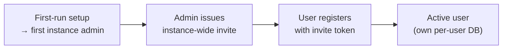
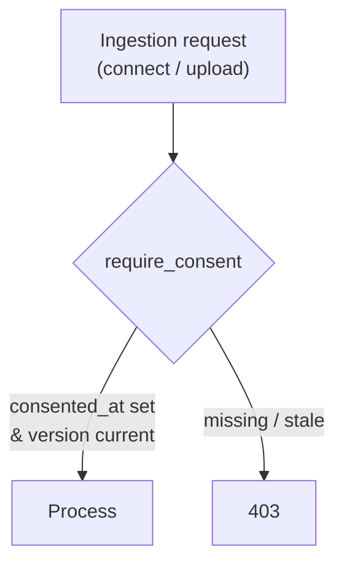

# Authentication, roles & onboarding

## Authentication

The backend authenticates requests with a **JWT bearer token**. The web app holds the access
token in memory and refreshes it transparently on a `401` (see [Frontend](frontend.md)).

- `POST /auth/login` — exchange credentials for an access token (and a refresh cookie).
- `POST /auth/refresh` — mint a new access token from the refresh cookie.
- `POST /auth/logout` — end the session.

All non-public API operations require the bearer token; the OpenAPI document declares a single
`bearerAuth` (HTTP bearer, JWT) security scheme applied globally.

The token is **token-scoped**: it carries only **`sub`** (the user) and **`roles`**. There is no
team in the token and no `{slug}` in any path — the authenticated user fully determines scope.

## Roles

The role model is reduced to two levels:

| Role | Capability |
|---|---|
| **User** | Owns and manages their own athlete profile and training data. |
| **Instance admin** | Everything a user can do, plus instance administration: managing users, issuing invitations, and editing instance-wide settings (including LLM configuration). |

There are only these two roles. Coaching across athletes does not exist in the single-instance
model, and all instance-wide administration is handled by the instance admin.

## Onboarding

Registration is **invite-only**:

1. **First run** — the setup wizard creates the first **instance admin**. No team is created.
2. An admin **issues an invitation** (instance-wide, no team association).
3. A new user **registers** with the invite token; registration is rejected without a valid
   instance-wide invitation.

## Consent

openkoutsi processes special-category **health data** (heart rate, weight, power), so it takes
each user's **explicit consent** before processing, on the GDPR Art. 9(2)(a) basis.

### Where consent lives

Consent is recorded **on the user row** in the registry DB — two columns absorbed from the
former standalone `data_consents` table:

- `users.consented_at` — timestamp of acceptance (`NULL` until accepted).
- `users.consent_version` — the policy version the user accepted.

`POST /api/consent` (`recordConsent`) sets both. The current version is
`CURRENT_CONSENT_VERSION` in `backend/app/api/consent.py`.

### Versioning & re-consent

`GET /api/athlete` exposes a computed `consent_accepted` flag that is true only when a consent
row exists **and** `consent_version` equals `CURRENT_CONSENT_VERSION`. Bumping the constant
therefore invalidates every prior acceptance and **forces re-consent** — the frontend surfaces
this as a re-consent step the next time the user signs in.

### Two enforcement layers

1. **UI gate** — the web app layout redirects any user without `consent_accepted` to the consent
   screen, so the app is unusable until consent is current.
2. **Server-side gate** — a `require_consent` FastAPI dependency guards the data-**ingestion**
   entry points independently of the UI, returning `403` when consent is missing or stale:
    - `GET /api/integrations/{provider}/connect` (Strava/Wahoo OAuth)
    - `POST /api/activities/upload` (manual FIT upload)

   Gating `connect` also covers provider **sync** transitively: no consented connection can be
   established, so the bridge/sync has nothing to ingest from. The OAuth `callback` is reached
   only via a consented `connect` and is protected by its signed `state`.

### Privacy policy & data rights

The consent screen links to the instance privacy policy at `PRIVACY_POLICY_URL` (default
`https://koutsi.dev/privacy`), exposed to the frontend via `GET /api/public/instance-info`.
Self-hosters are their own data controller and point this at their own policy.

Users can exercise their rights in-app at any time: **export**
(`GET /api/athlete/export`, a zip) and **erasure** (`DELETE /api/auth/account`, which hard-deletes
the user, drops the per-user DB, and revokes provider tokens).
