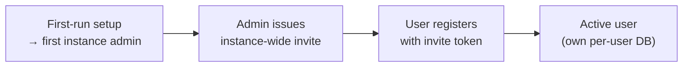

# Authentication, roles & onboarding

## Authentication

The backend authenticates requests with a **JWT bearer token**. The web app holds the access
token in memory and refreshes it transparently on a `401` (see [Frontend](frontend.md)).

- `POST /auth/login` — exchange credentials for an access token (and a refresh cookie).
- `POST /auth/refresh` — mint a new access token from the refresh cookie.
- `POST /auth/logout` — end the session.

All non-public API operations require the bearer token; the OpenAPI document declares a single
`bearerAuth` (HTTP bearer, JWT) security scheme applied globally.

The token is **token-scoped**: it carries only **`sub`** (the user) and **`roles`**. There is no
team in the token and no `{slug}` in any path — the authenticated user fully determines scope.

## Roles

The role model is reduced to two levels:

| Role | Capability |
|---|---|
| **User** | Owns and manages their own athlete profile and training data. |
| **Instance admin** | Everything a user can do, plus instance administration: managing users, issuing invitations, and editing instance-wide settings (including LLM configuration). |

There are only these two roles. Coaching across athletes does not exist in the single-instance
model, and all instance-wide administration is handled by the instance admin.

## Onboarding

Registration is **invite-only**:

1. **First run** — the setup wizard creates the first **instance admin**. No team is created.
2. An admin **issues an invitation** (instance-wide, no team association).
3. A new user **registers** with the invite token; registration is rejected without a valid
   instance-wide invitation.

## Consent

Data-consent is recorded **on the user row** in the registry DB. Users can export their data and
delete their account at any time.
