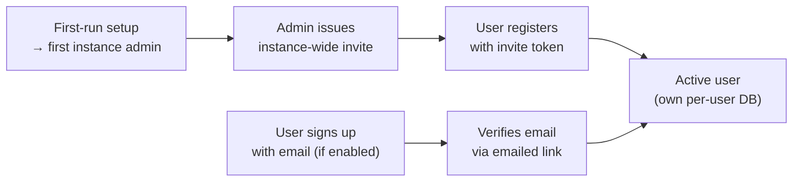
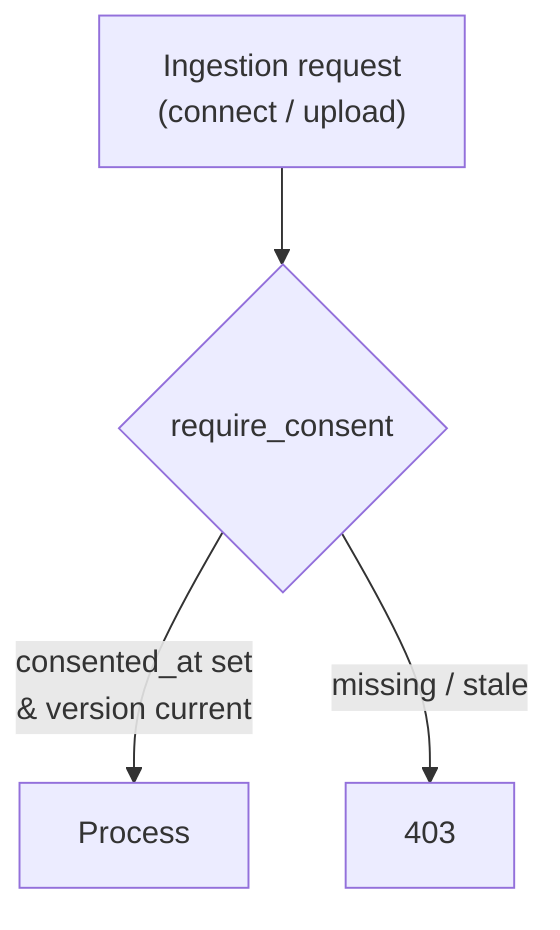

# Authentication, roles & onboarding

## Authentication

The backend authenticates requests with a **JWT bearer token**. The web app holds the access
token in memory and refreshes it transparently on a `401` (see [Frontend](frontend.md)).

- `POST /auth/login` — exchange credentials for an access token (and a refresh cookie).
- `POST /auth/refresh` — mint a new access token from the refresh cookie.
- `POST /auth/logout` — end the session.

All non-public API operations require a bearer token. The OpenAPI document declares a single
bearer security scheme applied globally — but "bearer" now covers **two credentials**, and the
header is the only thing they have in common:

| Credential | Shape | Lifetime | Scope |
|---|---|---|---|
| **Session access token** | JWT signed with `SECRET_KEY` | 60 min, renewed from the refresh cookie | Everything its owner can do |
| **Personal access token** | Opaque, `okp_{id}_{secret}`, DB-backed | 7–365 days, fixed at creation | Only the scopes granted, and only on routes that declared themselves reachable |

There is still exactly **one** security scheme, because a personal access token is presented in
the same `Authorization: Bearer …` header. Each operation additionally carries an
`x-personal-access-token` extension in the generated document, recording whether a token may
call it and which scope it needs.

The session token is **token-scoped**: it carries only **`sub`** (the user) and **`roles`**.
There is no team in the token and no `{slug}` in any path — the authenticated user fully
determines scope.

## Roles

The role model is reduced to two levels:

| Role | Capability |
|---|---|
| **User** | Owns and manages their own athlete profile and training data. |
| **Instance admin** | Everything a user can do, plus instance administration: managing users, issuing invitations, and editing instance-wide settings (including LLM configuration). |

There are only these two roles. Coaching across athletes does not exist in the single-instance
model, and all instance-wide administration is handled by the instance admin.

## Personal access tokens

Long-lived, scoped, revocable credentials a user issues to their own tooling — the first
third-party access path into the API, and the **first server-side revocable credential in the
system**. Nothing else here can be withdrawn before its own expiry: `POST /auth/logout` deletes
a cookie and nothing more, and an outstanding access token stays valid until its `exp`. That is
tolerable at 60 minutes and not at 90 days, so revocation is the feature rather than a checkbox
on it.

### Why opaque rather than a JWT

A long-lived JWT signed with `SECRET_KEY` would need the same lookup table to be revocable, so
it buys nothing — and `SECRET_KEY` already carries three unrelated purposes (the `access` and
`refresh` token types and the OAuth `state` claim). A PAT is therefore
`okp_{token_id}_{secret}`, stored as `sha256(secret)` and compared with `hmac.compare_digest`.
Deliberately **not** bcrypt: the secret is 256 bits of `secrets.token_urlsafe`, so there is no
brute-force surface to defend, bcrypt would add ~0.27 s to *every API request*, and a bcrypt
hash cannot be looked up. The embedded id makes verification one indexed equality query.

### One chokepoint

Resolution happens inside `get_current_user`, which routes on the `okp_` prefix **before**
attempting a JWT decode and returns an ordinary `UserContext`. Everything downstream —
`get_ctx_and_session`, `get_ctx_session_athlete`, `require_consent`, every
`Activity.athlete_id == athlete.id` filter — is unchanged. That is the whole argument for
putting it there and nowhere else: a second identity path would be a second place for the
per-user isolation guarantee to be lost.

`UserContext` gains `scopes`, `token_kind` and `token_id`. `scopes is None` means a session
token with full access, so no pre-existing route changed behaviour. `is_admin` is always false
for a token, whatever its owner's roles say.

### Scopes are default-deny

Vocabulary is per-resource read/write, named after the router tags `openapi.json` already groups
by: `activities:read`, `plans:write`, `metrics:read`, `athlete:export`, and so on. A router or
route declares what a token may do with it:

```python
router = APIRouter(prefix="/activities", tags=["activities"], dependencies=[
    pat_scopes(read="activities:read", write="activities:write"),
])

@router.get("/export", dependencies=[pat_scope("athlete:export")])   # route overrides router
@router.post("/analyze", dependencies=[pat_forbidden()])             # closed outright
```

The declaration enforces nothing itself; it records itself on `request.state`, and
`get_current_user` reads it back. Recording rather than enforcing is what makes this
default-deny: **a route that declares nothing leaves nothing on `request.state` and is
unreachable**, so a router added later is closed rather than open.

A convention only becomes a control when something fails without it, so
`tests/integration/test_pat_scopes.py` walks `app.routes` and fails when an authenticated route
carries no declaration.

### What a token can never reach

By allowlist, not denylist — each of these declares `pat_forbidden()` rather than merely
happening to lack a scope:

| Excluded | Why |
|---|---|
| `/api/admin/*` | Admin status must not widen the athlete-data surface. Excluded **even when the owner is an admin**. |
| `/api/auth/*`, `/api/setup` | A token must never mint or refresh a credential. No escalation loop. |
| The PAT endpoints themselves | A token cannot create, list or revoke a token; there is no internal minting path either. |
| `/api/messages` | The inbox is platform correspondence, and it is where this feature's own expiry warnings land. A credential should not be able to read the message saying it is about to be cut off. |
| `/api/consent` | Consent is the account holder's act, not a credential's. |
| `/api/llm/*` and the LLM triggers | They spend money. `check_llm_access` also denies a PAT outright, which covers the routes that trigger a call only *sometimes*. |

`GET /api/athlete/export` **is** reachable, under its own `athlete:export` scope and never
folded into a general read — one call that returns the entire record deserves its own grant, and
every use is audited by token id. One consequence is deliberate: the export zip contains the
inbox, so `athlete:export` reads messages indirectly even though `/api/messages` is closed. The
two rules agree in intent — a token may not *watch* the inbox, and a separately-granted, audited,
one-shot download of one's own record is a different act from a polling loop.

### The encryption context is not a boundary

`set_user_encryption_context()` derives the per-user key as
`HKDF(master=ENCRYPTION_KEY, info="user-key:{user_id}")`. The password is not an input and no
per-user key material is stored anywhere — which is why every background job already works. A
PAT-authenticated request resolves a `user_id`, derives the key, and reads everything the user
can.

**The corollary is the warning.** There is no crypto-level defence in depth here: the key falls
out of the user id. Scope enforcement is therefore the *only* boundary a PAT has, which is why
it is built as a default-deny control with a test behind it rather than a per-route convention.

### Lifetime, expiry and revocation

- **Every token expires**, 7–365 days, the ceiling enforced server-side on create rather than
  only in the picker. There is no "never".
- **A token is immutable.** Name, scopes and expiry are fixed at creation and there is no update
  endpoint. An editable token would make the audit log ambiguous — the same id meaning different
  things at different times — and turn every scope question into a question about *when*.
- **A daily `lifespan` task** sweeps the registry PAT table and sends `expiring_7d` /
  `expiring_1d` / `expired`, each stage exactly once via `last_expiry_notice` (without which a
  daily sweep becomes a daily nag). It sits beside the Strava and Wahoo bridge pollers, and
  inherits their single-process assumption — two app processes would double-notify, and
  `last_expiry_notice` is the mitigation. Tokens live in the **registry** DB and the inbox in
  each **per-user** DB, so the sweep reads registry rows then opens each affected user's session.
  Inbox always; email best-effort and opt-out per user via athlete `app_settings`.
- **Revocation is immediate** — no cache, no grace window — and **dead rows are retained**. The
  audit log stores token ids, so deleting rows would turn historical entries into unresolvable
  identifiers at the exact moment somebody is reconstructing what a leaked credential did; and
  keeping `token_hash` means a presented-but-revoked token stays *recognisable*, so "someone is
  using a credential we withdrew" is distinguishable from "someone is guessing". No pruning
  sweep.
- **Revoke-all on password reset**; `ondelete="CASCADE"` so account deletion takes tokens with
  it; `last_used_at` written coarsely (only when more than an hour stale) because a write on
  every request would be the hottest writer against a WAL SQLite registry with `pool_size=3`.

### The instance kill switch

`instance_settings.allow_personal_access_tokens` mirrors `allow_self_signup` in shape but
**defaults on**. The other gates default off to preserve existing behaviour, and a new feature
has none to preserve; a PAT grants strictly *less* than the session its owner already holds, so
it adds duration, not authority. Off by default would mean third-party access silently works
nowhere until an admin performs an action nobody told them about.

Critically, off refuses **authentication**, not just issuance — the check sits next to token
resolution in `get_current_user`, so a disabled instance 401s a token issued beforehand. Gating
only the create endpoint would leave every outstanding token working and tell the admin a
comforting untruth.

### Rate limiting and audit

`core/limiter.py` was `Limiter(key_func=get_remote_address)`. A PAT makes a per-principal key
both necessary — one script hammering from one address is not one anonymous visitor — and
finally possible, because a token id is a stable principal in a way an IP never was. The key
func now returns `pat:{token_id}` when the resolver set one and falls back to the address
otherwise, so the limits protecting the unauthenticated endpoints are untouched.

Every PAT-authenticated request is written to the `openkoutsi.audit` logger with token id, user,
route, method and outcome — **structured logs, not the shared usage DB**, because invocation
records against one person's health data do not belong in a database shared across users.
Outcomes distinguish `revoked` from `unknown_token`, which is what retaining dead rows buys.

### Admin visibility

Narrow, and it follows from the audit log: once limits and audit records are keyed by token id,
an admin investigating a runaway integration is staring at an id with no proportionate way to act
on it — the instance switch takes down every user and deleting the account is absurd. So
`GET`/`DELETE /api/admin/users/{id}/tokens[/{token_id}]`: **metadata only, never the name**
(names are user-written free text and revealing on their own), **revoke only, never
issue-on-behalf** (an admin-minted token would be indistinguishable from the user's own), audited,
and delivered to the user's inbox. It is not a new capability — the admin already holds
`ENCRYPTION_KEY` and root on the box — it moves the action out of a shell and into the log.

### What this does and does not unlock

The internal agent loop needs no token and must not get one: it runs in-process with the
`user_id` already in hand and dispatches tools as direct Python calls under
`set_user_encryption_context(user_id)`. Nothing auto-issues a PAT — a background task minting one
for itself would be a shared service credential wearing a PAT costume. Where PATs genuinely
unlock agentic use is an **external** client (Claude Desktop, an IDE, a third-party framework)
talking to an MCP endpoint from outside the process, holding a credential the user created
themselves.

## Onboarding

The first account always comes from the **setup wizard**; further accounts come from
**invitations**, and — where an admin opts in — from **self-serve email signup**.

### Invitations (always available)

1. **First run** — the setup wizard creates the first **instance admin**. No team is created.
2. An admin **issues an invitation** (instance-wide, no team association).
3. A new user **registers** (`POST /api/auth/register`) with the invite token, choosing a
   **username**; registration is rejected without a valid instance-wide invitation.

### Self-serve email signup (opt-in, default off)

Because openkoutsi is self-hostable, self-serve signup is an admin-configurable runtime
setting (`instance_settings.allow_self_signup`, default `false`) that also requires a
configured [email provider](overview.md). When both are true, anyone can register with an
**email** address:

1. `POST /api/auth/signup` (email + password) creates a **pending** account and emails a
   `…/verify-email?token=…` link. The response is always a generic acknowledgement, so the
   endpoint never reveals whether an email is already registered.
2. `POST /api/auth/verify-email` consumes the single-use, 1-hour token, sets
   `users.email_verified_at`, and **activates** the account (creating its per-user DB and
   athlete profile exactly like the invite path).

Email is a **login identifier alongside username** — `users.email` is unique and nullable,
so invited/legacy accounts keep logging in by username while signup accounts log in by their
verified email. `login` accepts either. Invitations keep working regardless of the toggle;
with no email provider configured, both signup and email password reset stay unavailable
rather than erroring.

### Password reset

- **Self-serve (email configured):** `POST /api/auth/request-password-reset` emails a
  `…/reset-password?token=…` link to a verified account. Always returns success (no account
  enumeration).
- **Admin-mediated (always):** `POST /api/admin/users/{id}/password-reset` mints the same link
  for an admin to deliver out-of-band.

Both consume the token via the unchanged `POST /api/auth/reset-password`. Verification and
reset tokens share the single-use, SHA-256-hashed, 1-hour pattern
(`email_verification_tokens` / `password_reset_tokens`).


```mermaid
flowchart LR
    Setup["First-run setup<br/>→ first instance admin"] --> Invite["Admin issues<br/>instance-wide invite"]
    Invite --> Register["User registers<br/>with invite token"]
    Register --> Active["Active user<br/>(own per-user DB)"]
    Signup["User signs up<br/>with email (if enabled)"] --> Verify["Verifies email<br/>via emailed link"]
    Verify --> Active
```

## Consent

openkoutsi processes special-category **health data** (heart rate, weight, power), so it takes
each user's **explicit consent** before processing, on the GDPR Art. 9(2)(a) basis.

### Where consent lives

Consent is recorded **on the user row** in the registry DB — two columns absorbed from the
former standalone `data_consents` table:

- `users.consented_at` — timestamp of acceptance (`NULL` until accepted).
- `users.consent_version` — the policy version the user accepted.

`POST /api/consent` (`recordConsent`) sets both. The current version is
`CURRENT_CONSENT_VERSION` in `backend/app/api/consent.py`.

### Versioning & re-consent

`GET /api/athlete` exposes a computed `consent_accepted` flag that is true only when a consent
row exists **and** `consent_version` equals `CURRENT_CONSENT_VERSION`. Bumping the constant
therefore invalidates every prior acceptance and **forces re-consent** — the frontend surfaces
this as a re-consent step the next time the user signs in.

### Two enforcement layers

1. **UI gate** — the web app layout redirects any user without `consent_accepted` to the consent
   screen, so the app is unusable until consent is current.
2. **Server-side gate** — a `require_consent` FastAPI dependency guards the data-**ingestion**
   entry points independently of the UI, returning `403` when consent is missing or stale:
    - `GET /api/integrations/{provider}/connect` (Strava/Wahoo OAuth)
    - `POST /api/activities/upload` (manual FIT upload)

   Gating `connect` also covers provider **sync** transitively: no consented connection can be
   established, so the bridge/sync has nothing to ingest from. The OAuth `callback` is reached
   only via a consented `connect` and is protected by its signed `state`.


```mermaid
flowchart TD
    Req["Ingestion request<br/>(connect / upload)"] --> Dep{"require_consent"}
    Dep -->|"consented_at set<br/>& version current"| Handler["Process"]
    Dep -->|"missing / stale"| Deny["403"]
```

### Privacy policy & data rights

The consent screen links to the instance privacy policy at `PRIVACY_POLICY_URL` (default
`https://koutsi.dev/privacy`), exposed to the frontend via `GET /api/public/instance-info`.
Self-hosters are their own data controller and point this at their own policy.

Users can exercise their rights in-app at any time: **export**
(`GET /api/athlete/export`, a zip) and **erasure** (`DELETE /api/auth/account`, which hard-deletes
the user, drops the per-user DB, and revokes provider tokens).

The export carries `personal_access_tokens.json` — metadata only, never the hash, covering dead
tokens as well as live ones. It is the **first registry-sourced entry** in an export otherwise
drawn entirely from the per-user DB, so `export_athlete()` threads a registry session through for
it.
