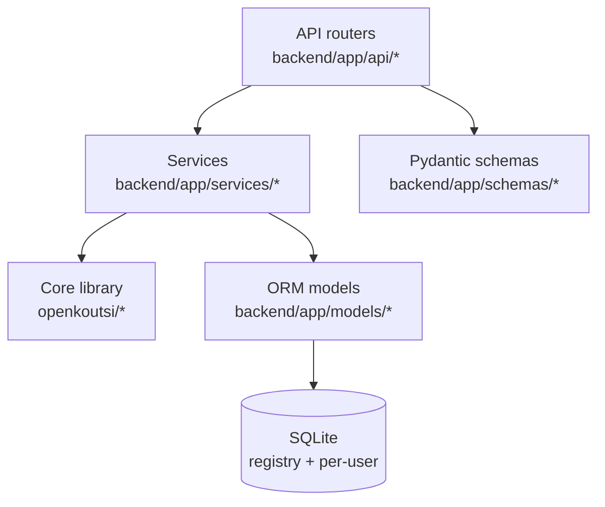
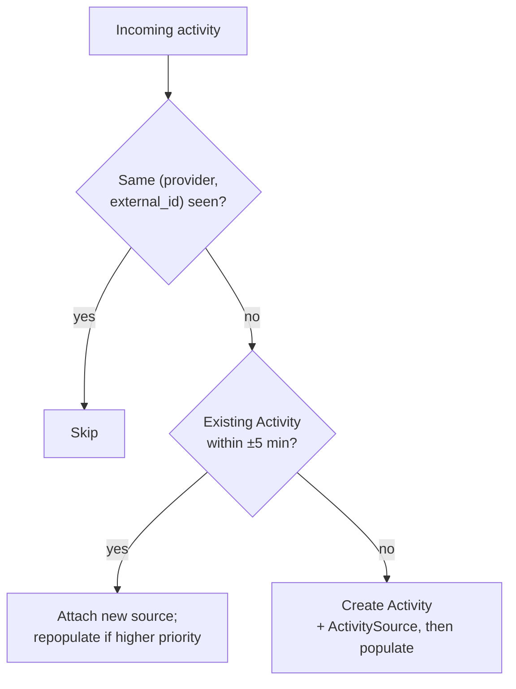

# Backend

The backend ([`openkoutsi-backend`](https://github.com/openkoutsi/openkoutsi-backend)) is a
FastAPI application backed by a pure-Python domain library. It owns all storage and runs the
background tasks that pull data in from Strava and Wahoo.

## Layering



- **Routers** (`backend/app/api/*`) — one module per resource (athlete, activities, metrics,
  goals, plans, workouts, integrations, messages, admin, …). They handle HTTP, validate input
  via Pydantic **schemas** (`backend/app/schemas/*`), resolve the authenticated user, and
  delegate to services. Mounted under `/api` by `backend/main.py`.
- **Services** (`backend/app/services/*`) — application logic: the provider-sync pipeline,
  `metrics_engine` (fitness/fatigue/form), the [LLM features](llm.md) (`llm_activity_analyzer`,
  `llm_plan_generator`, `llm_workout_generator`, `llm_training_status_analyzer`, and the shared
  `llm_client`), the `activity_workout_matcher`, `pr_detection`, and `notifications`.
- **Core library** (`openkoutsi/`) — framework-agnostic domain code with no FastAPI or DB
  imports: `fit`/`fit_processing` (FIT decoding), `training_math` (training load, weighted power,
  power/distance bests), `categorization` (Coggan zone classification), `plan_builder`,
  `workout_schema`, and the `workout_formats/` exporters (Zwift `.zwo`, FIT workout, Wahoo plan).
- **ORM models** (`backend/app/models/*`) — SQLAlchemy 2 async models split across the registry
  DB and the per-user DB (see [Data & storage model](data-model.md)).

## Application lifecycle

`backend/main.py` builds the FastAPI app, installs middleware (CORS scoped to the frontend
origin, a security-headers middleware, and a rate limiter), and includes every router. On
startup its lifespan handler initializes the registry database and the separate
[LLM-usage database](data-model.md) (see the [subscription gate & usage tracking](llm.md#subscription-gating-usage-tracking-issue-9)),
then launches the two **background pollers** as asyncio tasks:

```python
strava_poller = asyncio.create_task(strava_bridge_poller())
wahoo_poller  = asyncio.create_task(wahoo_bridge_poller())
```

Each poller loops every 60 seconds, fetches pending events from its bridge, processes them, and
claims them. See [Integrations](../integrations/index.md).

## The provider sync pipeline

`backend/app/services/provider_sync.py` is a **single generic pipeline** used by every provider
(Strava, Wahoo, and manual uploads). The provider-specific clients are looked up from a registry
and only differ in how they list activities and fetch data; the dedup, storage, and metrics
logic is shared.

### One workout, many sources

A real-world workout is modelled as **one `Activity`** with **one `ActivitySource` per
provider** that observed it. If you ride with a Wahoo head unit and also have Strava connected,
the same ride produces one `Activity` and two `ActivitySource` rows.

To decide which source's data populates the `Activity`'s metrics, sources are ranked by
**priority** (lower wins):

| Priority | Source |
|---|---|
| 1 | `upload` — manual FIT upload |
| 2 | `wahoo` — cloud sync **with** a FIT file |
| 3 | `strava` — Strava API (stream-based) |
| 4 | `wahoo` — cloud sync **without** a FIT file |
| 5 | `manual` — manually entered activity |

When a new source arrives with higher priority than the one currently populating the activity,
the metrics, streams, intervals and bests are deleted and re-derived from the better source.

### Find-or-create and deduplication

For each incoming activity the pipeline:

1. **Skips** it if this exact `(provider, external_id)` already has an `ActivitySource`.
2. Otherwise looks for an existing `Activity` within a **±5-minute window** of the start time.
   If found (and it doesn't already carry a source from this same provider), it **attaches a new
   source** to that activity rather than creating a duplicate.
3. Otherwise **creates** a new `Activity` + `ActivitySource`.



Because two providers can deliver the same ride almost simultaneously (a Wahoo webhook and a
Strava sync firing within milliseconds), the dedup-window query and the create/attach step run
under a **per-user activity lock**, and the new row is **committed before the lock is released**.
This prevents two concurrent syncs from each seeing an empty window and creating duplicates.

### Data population

Once a source is attached, the pipeline fills in the activity:

- **FIT-first** (Wahoo and any FIT-capable provider): download the FIT, store it
  **encrypted on disk** under the user's directory, parse it with the core library, and compute
  weighted power, training load, intensity, zone/category, power/distance bests, streams, and
  intervals.
- **Stream-based fallback** (Strava): pull the activity streams from the API and compute the
  same metrics from those samples.

OAuth tokens are refreshed transparently before expiry (`ensure_fresh_token`), with
provider-specific lookahead windows — see the per-provider pages.
