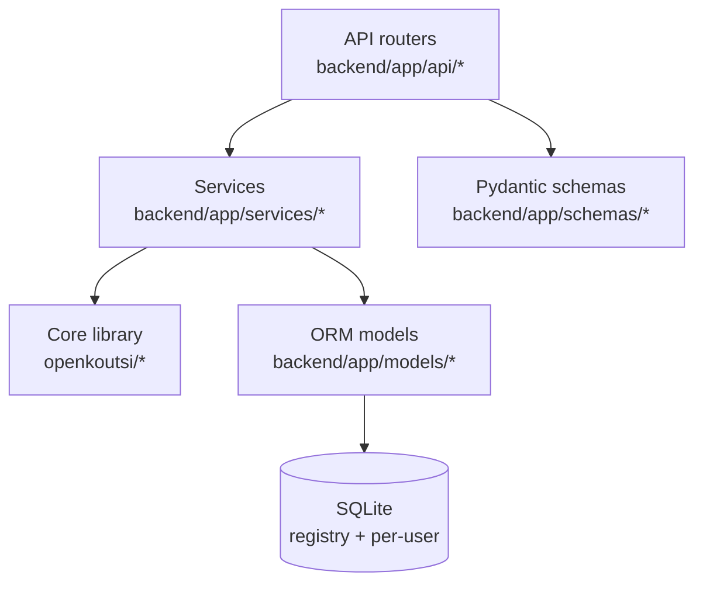
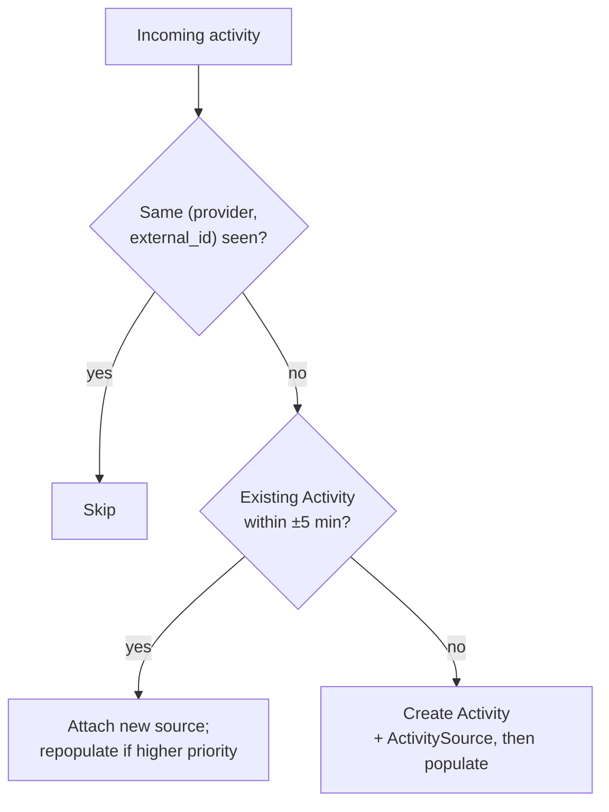

# Backend

The backend ([`openkoutsi-backend`](https://github.com/openkoutsi/openkoutsi-backend)) is a
FastAPI application backed by a pure-Python domain library. It owns all storage and runs the
background tasks that pull data in from Strava and Wahoo.

## Layering


```mermaid
flowchart TD
    R["API routers<br/>backend/app/api/*"] --> S["Services<br/>backend/app/services/*"]
    S --> Core["Core library<br/>openkoutsi/*"]
    R --> Schemas["Pydantic schemas<br/>backend/app/schemas/*"]
    S --> Models["ORM models<br/>backend/app/models/*"]
    Models --> DB[("SQLite<br/>registry + per-user")]
```

- **Routers** (`backend/app/api/*`) — one module per resource (athlete, activities, metrics,
  goals, plans, workouts, integrations, messages, admin, …). They handle HTTP, validate input
  via Pydantic **schemas** (`backend/app/schemas/*`), resolve the authenticated user, and
  delegate to services. Mounted under `/api` by `backend/main.py`.
- **Services** (`backend/app/services/*`) — application logic: the provider-sync pipeline,
  `metrics_engine` (fitness/fatigue/form), the [LLM features](llm.md) (`llm_activity_analyzer`,
  `llm_plan_generator`, `llm_workout_generator`, `llm_training_status_analyzer`, and the shared
  `llm_client`), the `activity_workout_matcher`, `plan_adherence` (deterministic plan-adherence
  scoring), `pr_detection`, and `notifications`.
- **Core library** (`openkoutsi/`) — framework-agnostic domain code with no FastAPI or DB
  imports: `fit`/`fit_processing` (FIT decoding), `training_math` (training load, weighted power,
  power/distance bests), `categorization` (Coggan zone classification), `plan_builder`,
  `workout_schema`, and the `workout_formats/` exporters (Zwift `.zwo`, FIT workout, Wahoo plan).
- **ORM models** (`backend/app/models/*`) — SQLAlchemy 2 async models split across the registry
  DB and the per-user DB (see [Data & storage model](data-model.md)).

## Application lifecycle

`backend/main.py` builds the FastAPI app, installs middleware (CORS scoped to the frontend
origin, a security-headers middleware, and a rate limiter), and includes every router. On
startup its lifespan handler initializes the registry database and the separate
[LLM-usage database](data-model.md) (see the [subscription gate & usage tracking](llm.md#subscription-gating-usage-tracking-issue-9)),
then launches the **periodic background tasks** as asyncio tasks:

```python
background = [
    asyncio.create_task(strava_bridge_poller()),
    asyncio.create_task(wahoo_bridge_poller()),
    asyncio.create_task(pat_expiry_sweeper()),
]
```

Each bridge poller loops every 60 seconds, fetches pending events from its bridge, processes
them, and claims them. See [Integrations](../integrations/index.md).

The **token-expiry sweep** loops daily and warns users whose
[personal access tokens](auth.md#personal-access-tokens) are about to expire. Periodic work here
is `lifespan` asyncio tasks rather than a scheduler dependency, which is why that feature needed
no new one — and why it inherits the pollers' **single-process assumption**: two app processes
would double-notify, and the `last_expiry_notice` column is the mitigation.

## The provider sync pipeline

`backend/app/services/provider_sync.py` is a **single generic pipeline** used by every provider
(Strava, Wahoo, and manual uploads). The provider-specific clients are looked up from a registry
and only differ in how they list activities and fetch data; the dedup, storage, and metrics
logic is shared.

### One workout, many sources

A real-world workout is modelled as **one `Activity`** with **one `ActivitySource` per
provider** that observed it. If you ride with a Wahoo head unit and also have Strava connected,
the same ride produces one `Activity` and two `ActivitySource` rows.

To decide which source's data populates the `Activity`'s metrics, sources are ranked by
**priority** (lower wins):

| Priority | Source |
|---|---|
| 1 | `upload` — manual FIT upload |
| 2 | `wahoo` — cloud sync **with** a FIT file |
| 3 | `strava` — Strava API (stream-based) |
| 4 | `wahoo` — cloud sync **without** a FIT file |
| 5 | `manual` — manually entered activity |

When a new source arrives with higher priority than the one currently populating the activity,
the metrics, streams, intervals and bests are deleted and re-derived from the better source.

### Find-or-create and deduplication

For each incoming activity the pipeline:

1. **Skips** it if this exact `(provider, external_id)` already has an `ActivitySource`.
2. Otherwise looks for an existing `Activity` within a **±5-minute window** of the start time.
   If found (and it doesn't already carry a source from this same provider), it **attaches a new
   source** to that activity rather than creating a duplicate.
3. Otherwise **creates** a new `Activity` + `ActivitySource`.


```mermaid
flowchart TD
    A["Incoming activity"] --> B{"Same (provider,<br/>external_id) seen?"}
    B -- yes --> Skip["Skip"]
    B -- no --> C{"Existing Activity<br/>within ±5 min?"}
    C -- yes --> D["Attach new source;<br/>repopulate if higher priority"]
    C -- no --> E["Create Activity<br/>+ ActivitySource, then populate"]
```

Because two providers can deliver the same ride almost simultaneously (a Wahoo webhook and a
Strava sync firing within milliseconds), the dedup-window query and the create/attach step run
under a **per-user activity lock**, and the new row is **committed before the lock is released**.
This prevents two concurrent syncs from each seeing an empty window and creating duplicates.

### Data population

Once a source is attached, the pipeline fills in the activity:

- **FIT-first** (Wahoo and any FIT-capable provider): download the FIT, store it
  **encrypted on disk** under the user's directory, parse it with the core library, and compute
  weighted power, training load, intensity, zone/category, power/distance bests, streams,
  intervals, a frozen per-activity `zone_times` snapshot (time-in-zone for power + HR,
  using the athlete's zones at processing time — see [data model](data-model.md)), and the
  aerobic response metrics: aerobic decoupling (or a reason code explaining why one would
  mislead), a frozen CP/W′ snapshot, and the derived `w_bal` stream.

    The aerobic step runs **after** the power bests are written, so the CP fit — restricted to
    bests as of the activity's own date — sees the ride's own efforts. It lives in
    `services/aerobic_metrics.py` rather than inline because **four** paths populate an activity
    from streams: manual FIT upload, the reprocess endpoint, and both provider paths above. The
    invariant they must all uphold — exactly one of `decoupling_pct` / `decoupling_reason` is
    set — is asserted per path in `tests/unit/test_writer_path_invariants.py`, so a fifth writer
    fails loudly instead of silently shipping nulls.

    A fit that lands outside physiologically plausible bounds is rejected outright rather than
    stored: the linear work–time model's intercept is unconstrained, so a rider who only rides
    steady routinely fits a negative or near-zero W'. Rejecting at the fit keeps "no CP → no
    columns, no stream" as the single failure mode, so the stored columns can never disagree
    with the presence of the stream.
    The `zone_times` snapshot is read back by more than the weekly chart: the three-band
    intensity distribution (issue #38) aggregates it over a block. That reader is why zone
    lists are now **fixed at seven power and five HR zones**, validated in `AthleteUpdate`
    and enforced on the provider sync path, which skips a non-conforming list rather than
    reshaping it. The band mapping is positional — Z1–Z2 below LT1, Z3–Z4 between the
    thresholds, Z5 and up above LT2 — so the thresholds come from the athlete's own zone
    boundaries and no "LT1 = 0.75 × FTP" constant exists anywhere. With a variable-length
    list that mapping would have had to infer band boundaries from watts, and a renamed or
    truncated list would have silently changed what a zone meant.

    Because the mapping is positional, the thing that carries a zone's position to every
    reader is its **name** — `time_in_zones` keys the frozen snapshot by it. Names are
    therefore **normalised on write** rather than validated: `AthleteUpdate` overwrites them
    with the canonical labels, and the provider sync path (which assigns provider dicts
    straight to the model, bypassing `ZoneSchema`) relabels them too. Validating count and
    ordering while leaving the name free-form enforced everything except the field the
    invariant actually rests on. Zone lists must also be **contiguous**: a value falling in a
    gap belongs to no zone, and `Zones.getZone` used to attribute it to the *top* one.

    Two properties of the snapshot constrain any reader of it. It is **partial** — only the
    zones the ride actually touched are keys — so zone position comes from the number in the
    zone's name, never from the key's index among those present; an easy ride storing three
    keys is not a three-zone athlete. Names are parsed with an **anchored** pattern and a
    bound on the number, and a snapshot carrying a name that can't be placed is dropped
    whole rather than guessed at: an unanchored parse read `VO2max` as zone 2 and
    `Sweet Spot 88-94%` as zone 88, the latter rescaling the band boundaries for every other
    zone in the same snapshot. Snapshots predating normalisation still hold whatever the
    athlete typed, so the parser cannot assume the invariant it now enforces.

    The snapshot also carries **no record of the FTP it was frozen against**, so a
    block-length aggregate can mix vintages. That is detected rather than ignored: the
    distribution flags a window where the recorded FTP changed value, or where one zone
    number appears under two different names. A pure boundary change that kept the names is
    not detectable from snapshots alone, which is why the flag is documented as "treat as
    approximate" rather than as a consistency proof.

    Reading a distribution performs **no writes**. The service is called from request
    handlers and from two LLM paths, one of which (`regenerate_plan` →
    `generate_plan_weeks_llm`) runs on a session carrying flushed-but-uncommitted deletions
    of a plan's workouts, left uncommitted precisely so an LLM failure rolls them back. A
    commit inside the read path would make them permanent before the LLM was called. Freezing
    missing snapshots is a separate, explicit call that only the endpoint makes, where the
    transaction is owned.

- **Stream-based fallback** (Strava): pull the activity streams from the API and compute the
  same metrics from those samples.

OAuth tokens are refreshed transparently before expiry (`ensure_fresh_token`), with
provider-specific lookahead windows — see the per-provider pages.

## Deterministic metrics: fitness and plan adherence

Two families of scores are computed by **plain arithmetic** in the core library and orchestrated
by services — never by the LLM, so they are always-on and **not gated behind the LLM
subscription**. The LLM daily training status may *reference* the numbers, but is not their source.

### Fitness / Fatigue / Form

`metrics_engine` applies the Banister impulse-response model (`openkoutsi.fatigue_metrics`) over
daily training Load, persisting a `daily_metrics` snapshot per day. `catch_up_metrics` backfills
missing days and repairs rows made stale by deleted activities.

### Forecasting Fitness / Fatigue / Form

`metrics_forecast` runs the **same** pure function forwards. `compute_daily_metrics` is just a
recurrence over a `{date: Load}` dict, so projecting the model is a new caller rather than new
math: where `metrics_engine` feeds it `Activity.load` for processed activities, the forecast feeds
it `PlannedWorkout.target_load` for the days ahead. Served by `GET /api/metrics/fitness/forecast`.

- **Seed** — the endpoint runs `catch_up_metrics` first, exactly as the dashboard does, so the seed
  is normally today's `daily_metrics` row (`0/0` with no history). Without that, the answer would
  depend on whether the client had hit `POST /metrics/catch-up` beforehand. Projection then runs
  from the day *after* the seed; rows up to and including today are dropped, so the measured series
  stays authoritative for everything it covers.
- **Bridging a stale seed** — when the seed still predates today, the gap is projected from the
  plan like any other day: the planned-load window starts at the seed, **not** at today. A window
  starting at today would decay the gap as pure rest even where the plan prescribes work, and the
  resulting error is one-directional — the athlete looks *fresher* than they are, the one direction
  that matters for "will I be fresh on race day?". The bridge is bounded to 180 days (as in
  `metrics_engine`'s recalculation lookback); beyond it the honest seed is `0/0`.
- **Date resolution** — `PlannedWorkout` stores `(week_number, day_of_week)`, not a date, so each
  workout is placed via the shared `plan_adherence.workout_date` helper relative to its plan's
  `start_date`. Plans with no `start_date` can't be placed on a calendar and are skipped.
- **Multiple active plans** — creating a plan only archives *overlapping* active ones, so several
  can be active simultaneously and two can contribute to the same day around a boundary. Loads are
  **summed** across active plans rather than one plan being picked; archived plans are excluded.
- **Rest and the tail** — days with no prescribed workout (and workouts with no `target_load`)
  contribute zero and therefore decay, and the projection continues past `plan.end_date` out to
  the horizon rather than stopping there.

**Nothing is persisted.** This is the deliberate difference from `daily_metrics` and
`plan_adherence_daily`: a forecast is only as good as the plan it was derived from, so any stored
copy is invalidated by every plan edit and would need the same self-healing staleness detection
those tables needed. Recomputing is a few hundred iterations of a two-line recurrence, so it is
computed on read instead — which also means no table, no migration, and no way for the projection
to disagree with the plan.

### Plan adherence scoring

Sits beside `activity_workout_matcher` and `metrics_engine`:

- **Pure math** — `openkoutsi/plan_adherence.py` (no FastAPI/DB imports).
- **Orchestration** — `backend/app/services/plan_adherence.py` (reads workouts + linked
  activities, rolls up the plan score, persists the snapshot).

Two scores are produced:

1. **Per-workout match score (0–100)** — how well the linked activity/activities fulfilled one
   planned workout. Since a workout may be satisfied by **several** linked activities, scoring
   operates on the **summed** actuals.
   - *Cycling* — graded on Load + duration with a symmetric per-dimension deviation
     `dim_score = clamp(1 − |actual − target| / target, 0, 1)` (on target → 1.0; 20% off either way
     → 0.8; ≥100% over or 0 → 0.0), blended `score = 100 × (0.70 × load_score + 0.30 ×
     duration_score)` when both targets exist, else whichever exists, else completion-only.
   - *Supplemental (non-cycling)* — done/missed (100 if ≥1 activity linked, else a miss).
   - A **completed** workout is floored at `COMPLETED_MIN_SCORE = 50` — a session that was
     actually done, however far off target (e.g. an 85-min endurance ride ridden as a 4-hour
     Z1/Z2 spin), never scores as low as an outright miss. The floor is applied at the service
     layer (`workout_match_score`); the pure per-dimension math stays unfloored. Missed and
     skipped workouts are unaffected.
2. **Plan adherence score (0–100)** — a Load-weighted roll-up over the *elapsed* portion of the
   plan: `adherence = 100 × Σ(weight_i × score_i / 100) / Σ(weight_i)`. Weight is `target_load`
   for cycling (fallback `duration_min`); supplemental workouts get a flat weight
   `0.75 × mean(cycling target_load)` (fallback `30`). Workout states:
   - **Completed** → the match score at full weight.
   - **Skipped** → score 0 at partial weight `(1 − f) × weight`, where the skip reason maps to a
     fixed forgiveness factor `f` (illness/injury `0.90`, fatigue `0.60`, travel `0.50`, weather
     `0.40`; unrecognized/free-form/none `0.10`) — a plain lookup, no free-text parsing.
   - **Missed** (past, empty, not a rest day) → score 0 at full weight.
   - **Rest day / future** → excluded. **Today** → scored provisionally if an activity is linked,
     otherwise held in grace until the day rolls over.

The 60% auto-match threshold in `activity_workout_matcher._matches` and the deviation used by the
score both draw on the shared `meets_threshold` comparison in `openkoutsi.plan_adherence`, so the
matcher gate and the score cannot drift apart.

Scores are surfaced on `PlannedWorkoutResponse.match_score` and `TrainingPlanResponse`
(`adherence_score` + summary), and persisted as a **`plan_adherence_daily`** snapshot per active
plan per day for charting via `GET /plans/{id}/adherence`. `catch_up_adherence` (mirroring
`catch_up_metrics`) recomputes every day in `[start_date, today]` for each active plan and
rewrites any snapshot that is missing **or stale** — self-healing stored days invalidated by
retroactive changes (a link/unlink to an old workout, an edited past workout, a formula change),
while leaving matching days untouched so the pass stays idempotent. It reads with
`populate_existing` so it always scores against current DB state. Recompute piggybacks the daily
first-read hook and the manual/webhook ingest paths — the Strava/Wahoo syncs now also auto-link
ingested activities to planned workouts so adherence does not silently under-count.
