# Data & storage model

openkoutsi stores everything in **SQLite** (WAL mode). The v2 architecture uses a two-tier
layout: one shared **registry database** plus **one database per user**.

!!! info "Change from v1"
    v1 was multi-tenant: a registry DB held users *and teams*, and each **team** got its own
    `teams/{id}/team.db` containing every member's athlete data. v2 **removes teams entirely**.
    Each user's data moves into `users/{id}/user.db`, and team-level configuration becomes a
    single instance-wide setting. The dual `/teams/{slug}` vs. token-scoped routing is collapsed
    to token-scoped only (see [API v2 contract](../api/index.md) and
    [Auth, roles & onboarding](auth.md)).

## Two tiers

```mermaid
flowchart TD
    subgraph Registry["Registry DB — data/registry.db (shared)"]
        U["users (roles + consent)"]
        I["invitations (instance-wide)"]
        PR["password_reset_tokens"]
        PC["provider_connections (encrypted tokens)"]
        IS["instance_settings (single row)"]
    end
    subgraph PerUser["Per-user DB — data/users/&#123;id&#125;/user.db"]
        Ath["athlete (one per DB)"]
        Act["activities + sources + streams + intervals"]
        Best["power / distance bests"]
        Goals["goals"]
        Plans["plans + planned workouts"]
        Work["workout definitions"]
        Msg["message inbox"]
    end
    subgraph Files["Filesystem"]
        Fit["encrypted FIT files (per user)"]
        Av["avatars (per user)"]
    end
    U -->|owns| PerUser
    U --> PC
    PerUser --> Files
```

### Registry DB (`data/registry.db`)

Shared, instance-wide tables:

- **`users`** — credentials, **`roles`**, and consent fields (the v1 `DataConsent` is absorbed
  into the user row).
- **`invitations`** — instance-wide invite tokens (no team association in v2).
- **`password_reset_tokens`**.
- **`provider_connections`** — a user's Strava/Wahoo OAuth connection. Access and refresh tokens
  are stored with an `EncryptedString` column type. A connection belongs to the **user globally**
  (one connect per provider, enforced by a `(user_id, provider)` unique constraint).
- **`instance_settings`** — a single-row table holding instance-wide configuration (e.g. LLM
  overrides that were previously per-team).

*Removed in v2:* `teams`, `team_memberships`, `join_requests`, `data_consents`.

### Per-user DB (`data/users/{user_id}/user.db`)

Everything a single athlete owns — **one athlete per database**:

- The **athlete** profile (FTP, zones, app settings).
- All **activities** with their `ActivitySource`, `ActivityStream`, `ActivityInterval`, and
  `ActivityPowerBest` / `ActivityDistanceBest` rows.
- **goals**, training **plans** (with planned workouts), and standalone **workout** definitions.
- The user's **message inbox**.

The schema is created idempotently, so an existing message-only DB simply gains the training
tables on first initialization.

## Encryption

Sensitive data is encrypted at rest and **re-keyed per user**:

- **Provider tokens** — `EncryptedString` columns in `provider_connections`.
- **FIT files** — written to the user's directory and encrypted on disk, derived from the
  user's key (`info="user-key:{user_id}"`).

Because keys are scoped to `user_id`, a user's data is cryptographically isolated even though all
users share one instance.

## Migrations

Schema changes are managed with **Alembic**. There are two migration environments: one for the
registry DB and one for the per-user DB schema (applied to each user database).

### Migration from v1 (team-based)

The collapse from teams to per-user databases is a one-time data migration. For each athlete the
migration script:

1. Initializes the user's database.
2. Copies every team-DB row into it, preserving IDs.
3. **Re-encrypts** FIT files and avatars from the old team key to the user key, and moves them
   under the user's directory.
4. Collapses roles (a user who was an administrator in any team becomes an instance
   administrator) and maps consent onto the user row.
5. Copies the first team's LLM settings into `instance_settings`.

Users who belonged to **multiple teams** are merged into a single athlete, with activities
de-duplicated by `(provider, external_id)`. After a verified run the team tables and the
`teams/` directory are removed.
