# Data & storage model

openkoutsi stores everything in **SQLite** (WAL mode). Storage is a two-tier layout: one shared
**registry database**, **one database per user**, and a small dedicated
**LLM-usage database**.

## Two tiers

```mermaid
flowchart TD
    subgraph Registry["Registry DB — data/registry.db (shared)"]
        U["users (roles + consent)"]
        I["invitations (instance-wide)"]
        PR["password_reset_tokens"]
        PC["provider_connections (encrypted tokens)"]
        IS["instance_settings (single row)"]
        EN["llm_entitlements (per-user LLM access)"]
    end
    subgraph Usage["LLM-usage DB — data/llm_usage.db (separate)"]
        LU["llm_usage (instance-paid calls only)"]
    end
    subgraph PerUser["Per-user DB — data/users/&#123;id&#125;/user.db"]
        Ath["athlete (one per DB)"]
        Act["activities + sources + streams + intervals"]
        Best["power / distance bests"]
        Goals["goals"]
        Plans["plans + planned workouts"]
        Work["workout definitions"]
        Msg["message inbox"]
    end
    subgraph Files["Filesystem"]
        Fit["encrypted FIT files (per user)"]
        Av["avatars (per user)"]
    end
    U -->|owns| PerUser
    U --> PC
    U --> EN
    U -.records.-> LU
    PerUser --> Files
```

### Registry DB (`data/registry.db`)

Shared, instance-wide tables:

- **`users`** — credentials, **`roles`**, and consent fields.
- **`invitations`** — instance-wide invite tokens.
- **`password_reset_tokens`**.
- **`provider_connections`** — a user's Strava/Wahoo OAuth connection. Access and refresh tokens
  are stored with an `EncryptedString` column type. A connection belongs to the **user globally**
  (one connect per provider, enforced by a `(user_id, provider)` unique constraint).
- **`instance_settings`** — a single-row table holding instance-wide configuration. Its LLM
  config is entirely the **`llm_models`** JSON column: a list of selectable presets (`name`,
  `label`, `base_url`, `model`, `api_key_enc`, `headers`, `body`) whose **first entry is the
  instance default**. Per-preset API keys are encrypted with `encrypt_instance_secret`. There is
  no instance single-config or global-headers column, and no env-var fallback (see the
  [LLM architecture](llm.md)). The single boolean **`llm_requires_subscription`** (default
  false) is the opt-in [LLM subscription gate](llm.md); until an admin flips it, LLM features
  work as before.
- **`llm_entitlements`** — a per-user "LLM access" entitlement (one row per user, `user_id`
  unique). A table rather than a role because it carries expiry, provenance and audit fields
  (`status`, `source`, `granted_by_user_id`, `starts_at`, `expires_at`, `external_ref`, `notes`)
  and is an idempotent upsert target for the future payment handler. Roles keep meaning
  *permissions*; entitlements mean *commercial state*. Entitled predicate:
  `status = active AND starts_at <= now AND (expires_at IS NULL OR expires_at > now)`.

### LLM-usage DB (`data/llm_usage.db`, path configurable via `LLM_USAGE_DB`)

A **separate** database — its own SQLAlchemy `Base`, engine, sessionmaker and Alembic chain
(head `001`) — holding one append-only row per **instance-paid** LLM call in a single
**`llm_usage`** table (`user_id`, `created_at`, `feature`, `provider`, `model`,
`prompt_tokens`, `completion_tokens`, `total_tokens`, `key_source`, `duration_ms`; indexed on
`(user_id, created_at)`). It is kept apart from the registry DB so its high-volume, unbounded
rows can be pruned/rotated independently, and it carries no registry foreign keys (a
user-deletion sweep is a plain `DELETE … WHERE user_id = ?`). Input and output tokens are stored
**separately** — providers price them differently. **BYOK calls are never recorded**: the hoster
pays nothing for them, so every row is instance-paid (there is no `byok` column). See the
[LLM architecture](llm.md).

### Per-user DB (`data/users/{user_id}/user.db`)

Everything a single athlete owns — **one athlete per database**:

- The **athlete** profile (FTP, zones, and `app_settings`). `app_settings` holds the user's
  **BYOK** LLM config: `llm_base_url`, `llm_model`, and `llm_api_key_enc` (encrypted per-user with
  `encrypt_secret(key, user_id)` and never serialized back — reads expose a derived
  `llm_api_key_set` boolean). A non-empty `llm_base_url` means BYOK is active and only the user's
  own config is used (the [no-mixing rule](llm.md#resolving-one-request)).
- All **activities** with their `ActivitySource`, `ActivityStream`, `ActivityInterval`, and
  `ActivityPowerBest` / `ActivityDistanceBest` rows.
- **goals**, training **plans** (with planned workouts), and standalone **workout** definitions.
  Each goal also carries on-demand AI-guidance columns (`guidance`, `guidance_verdict`,
  `guidance_status`, `guidance_updated_at`) — the streamed coach prose, its parsed
  `realistic`/`ambitious`/`unrealistic` verdict, and the pending/done/error state with a
  timestamp for pending-timeout recovery (mirroring the athlete's `training_status*` columns).
- The user's **message inbox**.

The schema is created idempotently, so an existing message-only DB simply gains the training
tables on first initialization.

## Encryption

Sensitive data is encrypted at rest and **re-keyed per user**:

- **Provider tokens** — `EncryptedString` columns in `provider_connections`.
- **FIT files** — written to the user's directory and encrypted on disk, derived from the
  user's key (`info="user-key:{user_id}"`).

Because keys are scoped to `user_id`, a user's data is cryptographically isolated even though all
users share one instance.

## Migrations

Schema changes are managed with **Alembic**. There are three migration environments: one for the
registry DB, one for the per-user DB schema (applied to each user database), and one for the
separate LLM-usage DB.

For how the storage model reached this two-tier layout, see [Version history](../version-history.md).
