# Data & storage model

openkoutsi stores everything in **SQLite** (WAL mode). Storage is a two-tier layout: one shared
**registry database** plus **one database per user**.

## Two tiers

```mermaid
flowchart TD
    subgraph Registry["Registry DB — data/registry.db (shared)"]
        U["users (roles + consent)"]
        I["invitations (instance-wide)"]
        PR["password_reset_tokens"]
        PC["provider_connections (encrypted tokens)"]
        IS["instance_settings (single row)"]
    end
    subgraph PerUser["Per-user DB — data/users/&#123;id&#125;/user.db"]
        Ath["athlete (one per DB)"]
        Act["activities + sources + streams + intervals"]
        Best["power / distance bests"]
        Goals["goals"]
        Plans["plans + planned workouts"]
        Work["workout definitions"]
        Msg["message inbox"]
    end
    subgraph Files["Filesystem"]
        Fit["encrypted FIT files (per user)"]
        Av["avatars (per user)"]
    end
    U -->|owns| PerUser
    U --> PC
    PerUser --> Files
```

### Registry DB (`data/registry.db`)

Shared, instance-wide tables:

- **`users`** — credentials, **`roles`**, and consent fields.
- **`invitations`** — instance-wide invite tokens.
- **`password_reset_tokens`**.
- **`provider_connections`** — a user's Strava/Wahoo OAuth connection. Access and refresh tokens
  are stored with an `EncryptedString` column type. A connection belongs to the **user globally**
  (one connect per provider, enforced by a `(user_id, provider)` unique constraint).
- **`instance_settings`** — a single-row table holding instance-wide configuration. Its LLM
  config is entirely the **`llm_models`** JSON column: a list of selectable presets (`name`,
  `label`, `base_url`, `model`, `api_key_enc`, `headers`, `body`) whose **first entry is the
  instance default**. Per-preset API keys are encrypted with `encrypt_instance_secret`. There is
  no instance single-config or global-headers column, and no env-var fallback (see the
  [LLM architecture](llm.md)).

### Per-user DB (`data/users/{user_id}/user.db`)

Everything a single athlete owns — **one athlete per database**:

- The **athlete** profile (FTP, zones, and `app_settings`). `app_settings` holds the user's
  **BYOK** LLM config: `llm_base_url`, `llm_model`, and `llm_api_key_enc` (encrypted per-user with
  `encrypt_secret(key, user_id)` and never serialized back — reads expose a derived
  `llm_api_key_set` boolean). A non-empty `llm_base_url` means BYOK is active and only the user's
  own config is used (the [no-mixing rule](llm.md#resolving-one-request)).
- All **activities** with their `ActivitySource`, `ActivityStream`, `ActivityInterval`, and
  `ActivityPowerBest` / `ActivityDistanceBest` rows.
- **goals**, training **plans** (with planned workouts), and standalone **workout** definitions.
- The user's **message inbox**.

The schema is created idempotently, so an existing message-only DB simply gains the training
tables on first initialization.

## Encryption

Sensitive data is encrypted at rest and **re-keyed per user**:

- **Provider tokens** — `EncryptedString` columns in `provider_connections`.
- **FIT files** — written to the user's directory and encrypted on disk, derived from the
  user's key (`info="user-key:{user_id}"`).

Because keys are scoped to `user_id`, a user's data is cryptographically isolated even though all
users share one instance.

## Migrations

Schema changes are managed with **Alembic**. There are two migration environments: one for the
registry DB and one for the per-user DB schema (applied to each user database).

For how the storage model reached this two-tier layout, see [Version history](../version-history.md).
