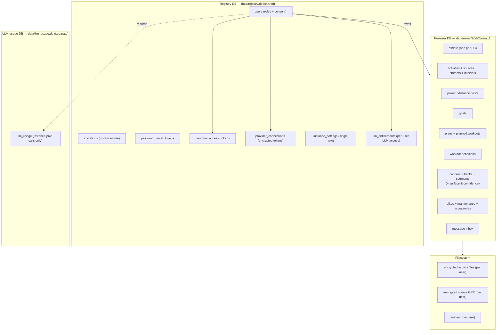

# Data & storage model

openkoutsi stores everything in **SQLite** (WAL mode). Storage is a two-tier layout: one shared
**registry database**, **one database per user**, and a small dedicated
**LLM-usage database**.

## Two tiers

```mermaid
flowchart TD
    subgraph Registry["Registry DB — data/registry.db (shared)"]
        U["users (roles + consent)"]
        I["invitations (instance-wide)"]
        PR["password_reset_tokens"]
        PAT["personal_access_tokens"]
        PC["provider_connections (encrypted tokens)"]
        IS["instance_settings (single row)"]
        EN["llm_entitlements (per-user LLM access)"]
    end
    subgraph Usage["LLM-usage DB — data/llm_usage.db (separate)"]
        LU["llm_usage (instance-paid calls only)"]
    end
    subgraph PerUser["Per-user DB — data/users/&#123;id&#125;/user.db"]
        Ath["athlete (one per DB)"]
        Act["activities + sources + streams + intervals"]
        Best["power / distance bests"]
        Goals["goals"]
        Plans["plans + planned workouts"]
        Work["workout definitions"]
        Crs["courses + tracks + segments<br/>(+ surface & confidence)"]
        Grg["bikes + maintenance + accessories"]
        Msg["message inbox"]
    end
    subgraph Files["Filesystem"]
        Fit["encrypted activity files (per user)"]
        Crsf["encrypted course GPX (per user)"]
        Av["avatars (per user)"]
    end
    U -->|owns| PerUser
    U --> PC
    U --> EN
    U --> PAT
    U -.records.-> LU
    PerUser --> Files
```

### Registry DB (`data/registry.db`)

Shared, instance-wide tables:

- **`users`** — credentials, **`roles`**, and consent fields.
- **`invitations`** — instance-wide invite tokens.
- **`password_reset_tokens`**.
- **`personal_access_tokens`** — long-lived, scoped credentials a user issues to their own
  tooling. Only `sha256(secret)` is stored (unique), alongside the user-written `name`, a
  JSON-encoded `scopes` list, `expires_at`, a coarsely-written `last_used_at`, `revoked_at` and
  `last_expiry_notice`. `user_id` is indexed and cascades on delete. **Expired and revoked rows
  are retained rather than pruned** — the audit log stores token ids, and a retained hash keeps a
  presented-but-revoked token distinguishable from an unknown one. See
  [Auth](auth.md#personal-access-tokens).
- **`provider_connections`** — a user's Strava/Wahoo OAuth connection. Access and refresh tokens
  are stored with an `EncryptedString` column type. A connection belongs to the **user globally**
  (one connect per provider, enforced by a `(user_id, provider)` unique constraint).
- **`instance_settings`** — a single-row table holding instance-wide configuration. Its LLM
  config is entirely the **`llm_models`** JSON column: a list of selectable presets (`name`,
  `label`, `base_url`, `model`, `api_key_enc`, `headers`, `body`) whose **first entry is the
  instance default**. Per-preset API keys are encrypted with `encrypt_instance_secret`. There is
  no instance single-config or global-headers column, and no env-var fallback (see the
  [LLM architecture](llm.md)). The single boolean **`llm_requires_subscription`** (default
  false) is the opt-in [LLM subscription gate](llm.md); until an admin flips it, LLM features
  work as before. **`allow_personal_access_tokens`** (default **true**, unlike the other gates —
  it preserves no prior behaviour) is the self-hoster's kill switch, checked at *authentication*
  so flipping it off stops tokens already issued.
- **`llm_entitlements`** — a per-user "LLM access" entitlement (one row per user, `user_id`
  unique). A table rather than a role because it carries expiry, provenance and audit fields
  (`status`, `source`, `granted_by_user_id`, `starts_at`, `expires_at`, `external_ref`, `notes`)
  and is an idempotent upsert target for the future payment handler. Roles keep meaning
  *permissions*; entitlements mean *commercial state*. Entitled predicate:
  `status = active AND starts_at <= now AND (expires_at IS NULL OR expires_at > now)`.

### LLM-usage DB (`data/llm_usage.db`, path configurable via `LLM_USAGE_DB`)

A **separate** database — its own SQLAlchemy `Base`, engine, sessionmaker and Alembic chain
(head `001`) — holding one append-only row per **instance-paid** LLM call in a single
**`llm_usage`** table (`user_id`, `created_at`, `feature`, `provider`, `model`,
`prompt_tokens`, `completion_tokens`, `total_tokens`, `key_source`, `duration_ms`; indexed on
`(user_id, created_at)`). It is kept apart from the registry DB so its high-volume, unbounded
rows can be pruned/rotated independently, and it carries no registry foreign keys (a
user-deletion sweep is a plain `DELETE … WHERE user_id = ?`). Input and output tokens are stored
**separately** — providers price them differently. **BYOK calls are never recorded**: the hoster
pays nothing for them, so every row is instance-paid (there is no `byok` column). See the
[LLM architecture](llm.md).

### Per-user DB (`data/users/{user_id}/user.db`)

Everything a single athlete owns — **one athlete per database**:

- The **athlete** profile (FTP, zones, and `app_settings`). `app_settings` holds the user's
  **BYOK** LLM config: `llm_base_url`, `llm_model`, and `llm_api_key_enc` (encrypted per-user with
  `encrypt_secret(key, user_id)` and never serialized back — reads expose a derived
  `llm_api_key_set` boolean). A non-empty `llm_base_url` means BYOK is active and only the user's
  own config is used (the [no-mixing rule](llm.md#resolving-one-request)).
- All **activities** with their `ActivitySource`, `ActivityStream`, `ActivityInterval`, and
  `ActivityPowerBest` / `ActivityDistanceBest` rows. Each activity also carries a
  `zone_times` snapshot (JSON — `{"hr": {"Z1": secs, …}, "power": {…}}`) accumulated from its
  per-second streams **at processing time, using the athlete's zones as they were then**. The
  snapshot is **frozen** once written: editing zones later only changes future activities, so
  historical weekly zone distributions stay stable. Legacy activities without a snapshot are
  backfilled on first read (using current zones) and then frozen. Note the snapshot only holds
  the zones a ride actually reached, so a missing key means "never went there", not "no such
  zone". The athlete's own `hr_zones` / `power_zones` are fixed-length — **five** and **seven**
  entries, contiguous, and with **API-owned names**: the write path overwrites whatever the
  athlete typed with the canonical labels, because the snapshot is keyed by name and the
  three-band mapping recovers a zone's position from it. Snapshots frozen before that rule
  are left as they are; they are mapped proportionally when their names can be placed, and
  dropped from the aggregate when they can't.

    Activities also carry **aerobic response metrics** (issue #37). Two of them are *not*
    stored: `efficiency_factor` (weighted power / avg HR) and `variability_index` (weighted /
    avg power) are pure ratios of columns already on the row, so they are **derived on read**
    in the response schema — the same reasoning as the per-workout match score above. Nothing
    can drift out of sync with its operands, and activities processed long before the feature
    existed carry both without a reprocess. Stored are the ones that need the streams or a
    point-in-time fit: `decoupling_pct` with a companion `decoupling_reason` (exactly one is
    set — a decoupling figure over a short or interval ride is noise, so the gate stores a
    stable reason code instead of a number), plus a `cp_w` / `w_prime_j` / `cp_fit_points`
    snapshot. `cp_fit_points` records how many duration bests that fit had available: a
    provider backlog import walks newest-first, so an old ride can be processed while almost
    nothing on or before its date exists yet, and this keeps those rides findable for a future
    re-fit rather than indistinguishable from a well-supported one. That
    snapshot is fit from the athlete's rank-1 power bests **as of the activity's own date**,
    not all-time, and is **frozen** for the same reason `zone_times` is: a ride's W′ story
    shouldn't silently change as the athlete's power curve moves. W′ balance itself is an
    `ActivityStream` row (`stream_type="w_bal"`, joules per second), following the `torque`
    precedent including its reprocess backfill. When CP can't be fit, both columns stay NULL
    and no stream is written — no W′ is invented.

    Finally, an activity carries two label columns rather than one (issue #63). `labels` is
    the athlete's own list — `race`, `commute` — and is the only one anything else reads:
    the `commuter` badge counts it, the RPE queue excludes it, `?exclude_labels=` filters on
    it. `label_suggestions` is what *openkoutsi* thinks, keyed by label name:
    `{"commute": {"state": "pending"|"accepted"|"dismissed", "source": "rule:<id>"|"strava",
    "at": …}}`.

    The split is load-bearing in both directions. Writing a guess into `labels` would mint
    achievement tiers off a heuristic *and* delete the ride from the RPE prompt — which is
    the one surface that asks about it — so a suggestion never touches `labels` until the
    athlete answers. And the suggestion is **persisted rather than derived on read**,
    because a dismissal has to outlive a reprocess: a suggestion recomputed on every read
    and re-offered after the athlete said no is worse than not detecting anything. `source`
    records which rule fired, which is what lets the "your rules look wrong" report be read
    straight off these rows instead of kept as counters that could drift.
- **Bulk import jobs** in `import_jobs` (issue #36) — one row per import of activity files:
  `status` (`pending` / `running` / `completed` / `failed`), `source_name`, the counts
  (`total_files`, `imported`, `skipped_duplicate`, `failed`), a JSON `results` list carrying
  one `{filename, outcome, reason, activity_id, format}` entry per file, and an `error` for
  when the *job* itself died as opposed to one file. The job is a row rather than a response
  because a Strava bulk export is thousands of files and tens of minutes of parsing — not a
  request a browser can hold open — so the endpoint returns an id and the client polls it.

    The per-file list is the part that earns its storage. "847 of 900 imported" is not
    something an athlete can act on; naming the 53 that were not, with the reason for each, is.
    `total_files` stays 0 until the archives have been walked, which is why progress is
    reported as `processed`/`total` rather than as a percentage — a percentage of an unknown
    total is a lie with a number on it.

    `ActivitySource` gained a `format` column (`fit` / `gpx` / `tcx`) at the same time.
    Originals are stored **in the format they arrived in** rather than normalised to FIT on
    ingest: normalising would keep `has_fit_file`, the download and reprocess on a single path,
    but it is lossy and it means the file an athlete downloads is not the file they uploaded.
    Both readers dispatch on the column instead. NULL means the row predates the column, in
    which case it is a FIT — nothing else could have been stored.
- **goals**, training **plans** (with planned workouts), and standalone **workout** definitions.
  Each goal also carries on-demand AI-guidance columns (`guidance`, `guidance_verdict`,
  `guidance_status`, `guidance_updated_at`) — the streamed coach prose, its parsed
  `realistic`/`ambitious`/`unrealistic` verdict, and the pending/done/error state with a
  timestamp for pending-timeout recovery (mirroring the athlete's `training_status*` columns).
  A planned workout can be satisfied by **several** activities via the
  `planned_workout_activities` join table.
- Deterministic **daily snapshots**: `daily_metrics` (fitness/fatigue/form + daily Load) and
  `plan_adherence_daily`. The latter, keyed by `(athlete_id, plan_id, date)`, stores the plan's
  "so far" adherence `score` (Float, nullable) plus denormalized counts (`completed`, `missed`,
  `skipped`, `pending`) — one snapshot per active plan per day, same shape/pattern as
  `daily_metrics`. The per-workout match score is **derived on read**, not stored.
- Earned **achievement tiers** in `achievement_unlocks`, keyed by
  `(athlete_id, achievement_id, tier)`. Derived state like the snapshots above, with two
  differences worth noting. First, the **catalogue lives in code** (`openkoutsi.achievements`), not
  in rows — `achievement_id` is a stable machine key whose display name is an i18n string in the
  web app, so no user-facing prose is stored and adding an achievement needs no migration. Second,
  the reconcile pass **deletes as well as inserts**: unlocks are a pure function of the athlete's
  current data, so removing the activity that earned a tier revokes it rather than leaving a badge
  the history no longer supports. The two timestamps do different jobs — `achieved_on` is derived
  from the history (back-filling an old ride moves it *earlier*, never to today), while
  `created_at` is wall-clock and only drives the "new" marker and the inbox notification.
- **Courses** (issue #55) in `courses`, `course_tracks`, `course_segments`, plus the `bikes`
  they are solved for. This is the one place route geometry is persisted, per the decision in
  issue #54, and the split across three tables is what keeps that exception contained.

    `courses` carries only **coordinate-free** data: the metadata, the athlete's inputs (a
    target, start time, an optional `goal_id`), a snapshot of the FTP and weight the last
    analysis used, a ≤400-point `[distance, elevation, gradient]` chart profile, and the pacing
    outcome. An unachievable target is stored as an outcome rather than an error — `feasible`
    false with a `refusal_reason` and the intensity it would have taken — because refusing is
    an answer the athlete asked for.

    The target is `target_time_s` **or** `target_power_w` (issue #61), never both: the API
    clears one when the other is set and refuses a request carrying both. That rule lives in
    the API rather than in a CHECK constraint because SQLite cannot add one to an existing
    table without rebuilding it, and a rebuild is a far bigger risk than the rule is worth. The `plan_*` columns copy `Goal.guidance*` exactly, down
    to the `updated_at` that makes the pending timeout an inactivity budget, so
    `stranded_runs` settles them at boot with everything else.

    They add one column the guidance shape has no need of: **`plan_run_id`**, the token a
    plan run owns its columns by. Guidance is only ever cleared by the run that owns it;
    a course plan can be invalidated *from outside*, because re-analysing the course makes
    prose about the old segment table wrong. Nulling the columns cannot express that — the
    generator holds its own session and commits after the request that cleared them, so it
    would write the stale plan straight back and end on `done` with splits keyed to distances
    that no longer exist. The trigger stamps the token, re-analysis and `settle_course_plan`
    clear it, and a run that no longer holds it discards its own writes.

    `course_tracks` is the thinned track — one row per course, points as a JSON series in the
    `ActivityStream` manner rather than a row per point. The point count is capped
    (`openkoutsi.course.MAX_THINNED_POINTS`), because an unbounded count is an unbounded row
    and re-analysis re-materialises it in full: past the cap the spacing widens, so an absurdly
    long upload degrades in resolution rather than in size. It is a separate table on purpose:
    reading a course, listing courses and building the LLM prompt all touch rows with nothing
    location-shaped in them, and only re-analysis loads this one. `course_segments` is the
    `ActivityInterval` of a course, replaced wholesale when an analysis is re-run.

    **Surface classification (issue #56)** adds nullable columns to all three. On
    `course_segments`: the class, its confidence, the raw matcher value preserved rather
    than discarded, and the `Crr` the row was solved with — so a number the athlete is
    asked to trust can be inspected. On `courses`: the `surface_*` status columns, copying
    the `plan_*` shape (run token included) so `stranded_runs` settles an interrupted match,
    plus **`surface_ribbon`** — the surface at full run resolution, run-length encoded as
    `[start_m, end_m, class, confidence, severity_step]`.

    That ribbon is a separate column rather than something derived from `course_segments`
    because the two have different jobs. The segment table is pacing-shaped and keeps a
    minimum row length; the ribbon has none. A 130 m sector of mud inside 40 km of asphalt
    is the most important thing on that course, and it has to stay drawable and nameable
    even where the pacing rows quite reasonably fold it into a longer one. The rough-sector
    list the API serves is derived from the ribbon rather than stored beside it — a second
    copy is a second thing that can disagree.

    `course_tracks` gains `surfaces`: `[[raw_value, confidence], …]` aligned to `points`.
    Only what the matcher said is stored; the class and every dissolving decision are
    re-derived on read, so tuning a threshold later re-reads correctly from what is already
    on disk instead of needing every stored course re-matched. It lives on this table
    because it is the same length as the track and, like the track, is loaded only by
    re-analysis — listing courses and building the plan prompt keep touching rows with
    nothing per-point in them.

    `bikes` exists because the physics needs tyre width (rolling resistance) and riding
    position (drag area), and nothing on the athlete described the bike. A table rather than
    profile fields because those inputs change per event. Both `courses.bike_id` and
    `courses.goal_id` are `ON DELETE SET NULL`: deleting a bike or a goal must never take a
    course with it.
- **The garage** (issue #64) is the *same* `bikes` rows, extended rather than duplicated, plus
  `bike_maintenance` and `bike_accessories` hanging off them and two columns on `activities`.

    The extension-not-duplication choice is the load-bearing one. A parallel `garage_bikes`
    table would have made "the bikes in the garage are the bikes the course picker offers" a
    synchronisation problem — two lists, two writers, and an inevitable divergence the athlete
    discovers by not finding a bike. Extending the row makes it true by construction, and costs
    only that one table now serves two readers with quite different needs.

    `bikes` gains `odometer_base_km` (kilometres ridden before openkoutsi existed for that bike
    — without it every wear figure is systematically low), `default_sports` (the cycling
    `sport_type` values it claims) and `retired_at`. Retirement rather than deletion for a sold
    bike, because deleting rewrites the athlete's past totals: a retired bike leaves the pickers
    and stops collecting rides while keeping every one it has.

    `activities` gains `bike_id` (indexed — every per-bike distance is a `SUM` filtered on it)
    and **`bike_source`**, which is the column this whole feature turns on. Unlike commute
    detection (issue #63) the assignment is *applied*, not suggested: no badge counts bikes, no
    prompt hides a ride because of one, and a per-bike total counting only individually
    confirmed rides is a chore rather than a garage. The safety property #63 got from a
    suggestion state is carried here by a persisted `"auto"` / `"manual"` marker instead —
    `services/garage.assign_bike` writes only where it is NULL or `"auto"` — so a correction
    survives a reprocess, a re-sync, a history scan and an edit to what a bike claims. It cannot
    be inferred at read time; it has to be written down.

    A sport may be claimed by **at most one bike per athlete**, enforced in the API rather than
    by a constraint (it is a per-athlete uniqueness over a JSON list). Two bikes claiming
    `GravelRide` has no correct resolution, so the second claim is a 409 naming the first.
    Retired bikes are excluded from both the claim map and the collision check: retiring one
    bike and buying its replacement is the ordinary case.

    Distance is **derived on read**, never stored — `tracked_km` a `SUM` over assigned rides and
    `lifetime_km` that plus the baseline. Reassigning a ride or correcting a baseline is then
    immediately right everywhere, with no denormalised counter to drift; the price is one grouped
    query per garage read, which the index makes cheap. The two are reported separately because
    one is arithmetic on the history and the other leans on a number the athlete typed.

    `bike_maintenance` is keyed by a free-text `component` rather than a foreign key to a
    component catalogue, which is what makes "how long did these tyres last?" answerable at all:
    component life is the delta in `odometer_km` between consecutive entries sharing the key. The
    reading is stored **absolute**, never as an offset from anything derived, so it does not move
    when history is re-imported, a baseline is corrected or a ride is reassigned — a maintenance
    log that rewrites itself is worse than none. `bike_accessories` is deliberately inert: a
    fitted trailer changes mass and CdA, but feeding that into `BikeParams` is a separate piece
    of work with its own correctness questions, so this records the thing and moves no number.

    Deletion follows the same rule the rest of this schema does — `ON DELETE` documents intent
    and does not execute, since these SQLite connections leave `PRAGMA foreign_keys` off — so
    `api/bikes.delete_bike` enforces each clause in Python: an explicit `UPDATE` nulls
    `activities.bike_id` **and** `bike_source` (a `"manual"` against no bike would assert a
    choice that cannot be true, and would then block automapping from filling the gap), and the
    ORM `delete-orphan` cascade, which is application-level and so also pragma-independent,
    takes the log and the accessories.
- The user's **message inbox**.
- **Koutsi conversations** (issue #44) in `chat_conversations` / `chat_messages`. Like the inbox,
  the database file identifies the owner, so there is no owner column and no `WHERE user_id = …`
  anyone could forget — a conversation id minted in another user's DB simply is not in this one.

    The assistant row is created **before** its answer exists, in `queued`, and streamed into in
    place. It is the same stream-into-a-column shape the daily card uses, moved off a singleton
    column on `athletes` and onto a row per turn, which is what lets a reload mid-answer resume
    rather than lose the turn. `updated_at` is touched on every progress commit, so the
    stuck-turn check means "no progress for N minutes" rather than "started N minutes ago" — the
    distinction issue #91 had to introduce for the daily card, and for the same reason: an agent
    run against a slow local model is many completions and must not be declared dead while it is
    healthy.

    **Only the dialogue is stored.** Tool calls and their results are deliberately absent, though
    replaying them was the obvious design: they are almost all of the bytes, they go stale (the
    tools are read-only, so re-running one on a later turn is *more* correct than replaying its
    old answer), and they are working rather than dialogue. Only `tool_names` is kept — in call
    order, and written through on every progress marker rather than when the turn settles, so a
    turn that is still gathering can already show the lookups behind it.
    See [LLM & AI features](llm.md#conversational-koutsi-issue-44).

    History replayed to the model is built from **whole turns**, not from filtered rows: a
    question is sent only with the answer it actually received. Filtering rows independently is
    the obvious implementation and produces a non-alternating conversation the moment a turn
    fails — two adjacent questions, or the same one twice after a retry — which several Jinja
    chat templates reject or silently merge, and those are the BYOK local-model setups this is
    built for.

    `chat_messages` declares `ON DELETE CASCADE` to its conversation, but `PRAGMA foreign_keys`
    is **off** on these connections, so that is documentation rather than behaviour: the delete
    endpoint removes the messages explicitly. Relying on the cascade would orphan every row of a
    thread the athlete believed they had deleted.

The schema is created idempotently, so an existing message-only DB simply gains the training
tables on first initialization.

## Encryption

Sensitive data is encrypted at rest and **re-keyed per user**:

- **Provider tokens** — `EncryptedString` columns in `provider_connections`.
- **Activity files** — written to the user's directory and encrypted on disk, derived from the
  user's key (`info="user-key:{user_id}"`). Whatever format the original arrived in: a GPX is
  stored as a GPX. A bulk import stages its archive under
  `users/{id}/uploads/imports/{job_id}/` and deletes that directory when the job ends,
  whatever the outcome; only the files that became activities are moved into the uploads
  directory and encrypted.
- **Course files** — the uploaded GPX, in the same directory and under the same derived key,
  with one difference that matters: the row stores an **opaque storage key** (a bare filename,
  resolved against the user's upload directory with a containment check at read time) rather
  than the absolute path `ActivitySource.fit_file_path` and `Athlete.avatar_path` persist.
  Issue #51 exists to convert those two; a blob type landing after it was written should not
  add a third.

Because keys are scoped to `user_id`, a user's data is cryptographically isolated even though all
users share one instance.

## Migrations

Schema changes are managed with **Alembic**. There are three migration environments: one for the
registry DB, one for the per-user DB schema (applied to each user database), and one for the
separate LLM-usage DB.

For how the storage model reached this two-tier layout, see [Version history](../version-history.md).
