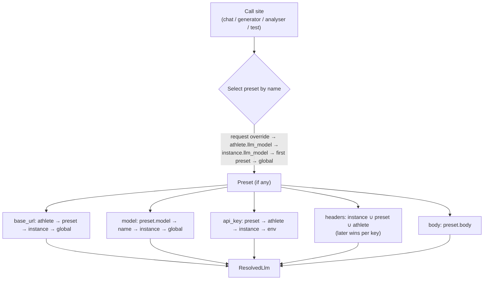

# LLM & AI features

openkoutsi's coaching intelligence is delivered by a language model, but the platform
deliberately **owns no model and hard-codes no provider**. Every AI feature is built on a small,
uniform abstraction: an **OpenAI-compatible chat-completions API** reached through a
server-side proxy. Anything that speaks that dialect — a local
[Ollama](https://ollama.com/) instance, a hosted OpenAI-compatible endpoint, or a gateway in
front of several providers — can be plugged in without code changes.

The features are **optional**: if no endpoint is configured, or the user never triggers an AI
action, nothing is ever sent to a model and every other feature keeps working.

## The features

Four services under `backend/app/services/` use the LLM, plus one pass-through proxy:

| Feature | Service | Shape |
|---|---|---|
| **Activity analysis** | `llm_activity_analyzer` | Streaming prose |
| **Daily training status** | `llm_training_status_analyzer` | Streaming prose |
| **AI plan generation** | `llm_plan_generator` | One-shot JSON |
| **AI workout generation** | `llm_workout_generator` | One-shot JSON |
| **Chat proxy** | `POST /api/llm/chat` (`backend/app/api/llm.py`) | Streaming or one-shot, browser-driven |

The two **analysers** stream Server-Sent Events (SSE) straight through to the browser so the
user sees text as it is generated. The two **generators** make a blocking call and parse the
model's reply as JSON (`extract_json` strips markdown fences before `json.loads`), retrying once
with a correction nudge if the first response doesn't parse. The **chat proxy** lets the
frontend call the configured model directly for interactive use, without the API key ever
reaching the browser.

## OpenAI compatibility

Every call targets the OpenAI **`POST {base_url}/chat/completions`** contract and nothing else:

- **Request** — `{"model", "messages": [{role, content}], "stream", …}`. Roles are the usual
  `system` / `user` / `assistant`.
- **Response** — non-streaming replies are read from `choices[0].message.content`; streaming
  replies are consumed as `data:`-prefixed SSE chunks, extracting
  `choices[0].delta.content`, terminated by `data: [DONE]`.
- **Auth** — a bearer token in the `Authorization` header, when a key is configured.

Because that surface is tiny and universally implemented, "provider support" is a matter of
**configuration, not code**. Two deliberate compatibility choices keep a wide range of models
working out of the box:

!!! note "Temperature is omitted by default"
    `temperature_param()` leaves the `temperature` field **out** of the request unless a caller
    passes an explicit value, so each model applies its own default. This keeps thinking-enabled
    models — which reject any temperature other than `1` — working without special-casing.

!!! note "Upstream errors are surfaced, not swallowed"
    `raise_for_llm_status()` reads and includes the provider's response body in the raised error
    and the log line (httpx's built-in `raise_for_status` discards it). That body is where an
    OpenAI-compatible provider explains a 400/422 — e.g. an unsupported parameter for a thinking
    model — so failures are diagnosable.

## Presets: provider- and model-agnostic configuration

A **preset** is a self-contained (or partial) connection. An admin can offer several — e.g.
a fast local model next to one or more hosted providers — and users pick one. Each preset carries:

| Field | Meaning |
|---|---|
| `name` | Stable identifier (the stored selection value) |
| `label` | Human-friendly display name shown in the picker |
| `base_url` | The provider endpoint |
| `model` | The upstream model id sent in the request |
| `api_key` | Per-preset credential (encrypted at rest; see below) |
| `headers` | Extra request headers merged into every call for this preset |
| `body` | Extra chat-completion body params merged into every request |

Any omitted field **falls back to the instance-level default**, so a preset can be as small as a
model name or as complete as a full third-party provider. The `headers` and `body` fields are
what make the abstraction provider-agnostic in practice:

- **`headers`** carry provider-specific needs — a zero-data-retention header, an API version
  header, a gateway routing header — without the code knowing about any of them.
- **`body`** carries per-model tuning — `max_tokens`, a `reasoning_effort` level, a nested
  thinking config — attached to the one model that needs it. Core fields
  (`model` / `messages` / `stream`) always win, so extras can add but never break the request
  (`apply_body_extras`).

Presets live in JSON columns: instance-wide in `instance_settings.llm_models` /
`llm_extra_headers`, and per-user in the athlete's `app_settings`. See the
[data & storage model](data-model.md).

## Resolving one request

All call sites funnel through **`resolve_llm()`** in `backend/app/services/llm_client.py`, which
produces a single `ResolvedLlm` (base URL, model, key, headers, body). Every field is resolved
independently with an **athlete → preset → instance → global** priority, so a user can lean on
the instance default for most things while overriding just the pieces they care about.

Two thin wrappers adapt this for their callers:

- **`resolve_llm_config(athlete, instance, user_id)`** — the athlete-aware path used by the chat
  proxy and the generators; raises when no base URL can be determined.
- **`resolve_instance_llm(instance)`** — the instance-only path used by the automated analysers
  and the admin connection test, which aren't tied to a particular user's overrides.

`GET /api/llm/models` returns the presets a user may select (`{name, label}`) plus their current
effective selection, so the UI picker mirrors exactly what `resolve_llm()` would choose.

## Security model

The browser never talks to the LLM directly — every call is **proxied server-to-server**:

- **Keys stay on the server.** API keys are encrypted at rest — instance keys with a Fernet key
  (`encrypt_instance_secret`), per-user keys with an HKDF-derived per-user key
  (`encrypt_secret(key, user_id)`) — decrypted in memory only for the outbound request, and
  **never returned to the browser** (`api_key_set` booleans only).
- **SSRF defences.** Because a user-supplied base URL could point at internal services,
  `check_url_safe()` accepts only `http`/`https`, resolves the hostname and **rejects
  link-local addresses** (the cloud metadata range), disables redirects, and connects to the
  pre-resolved IP to blunt DNS rebinding. An optional admin **allow-list**
  (`LLM_ALLOWED_SERVERS`) is re-checked against the resolved base URL at call time.
- **Bounded responses.** The proxy caps an upstream response at 32 MB to avoid unbounded memory
  use.

## Testing a connection

`POST /api/llm/test-connection` (admin-only) sends a minimal "hello world" chat completion using
the selected preset's endpoint, headers and body params, and confirms a non-empty
`choices[0].message.content` comes back. Because it exercises the **real** request path — not a
`GET /models` listing — it also validates a ZDR header or a thinking config, and returns both the
prompt sent and the model's reply for display.

## Why this shape

- **No lock-in.** Swapping providers, running fully local, or fronting several models behind a
  gateway are all configuration, never code.
- **One code path.** Every feature resolves config and makes requests the same way, so a change
  to headers, body handling, or SSRF policy applies everywhere at once.
- **Privacy is a deployment choice.** Whether data leaves the server is decided entirely by the
  configured endpoint — a property the [user documentation](https://openkoutsi.github.io/openkoutsi-docs/)
  makes explicit to end users.
