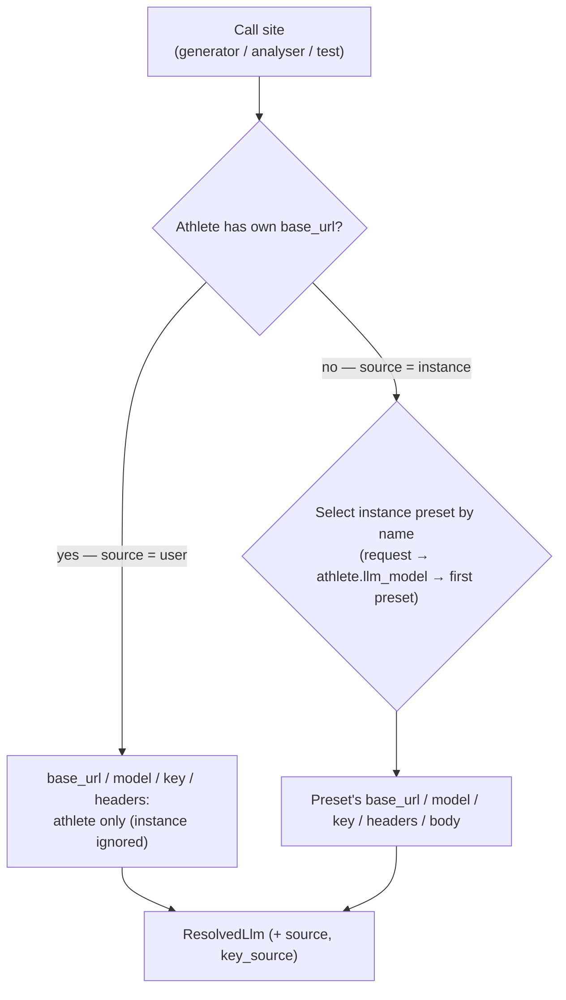
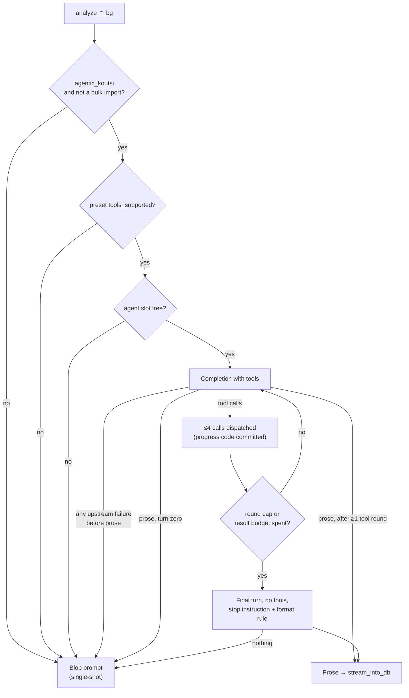

# LLM & AI features

openkoutsi's coaching intelligence is delivered by a language model, but the platform
deliberately **owns no model and hard-codes no provider**. Every AI feature is built on a small,
uniform abstraction: an **OpenAI-compatible chat-completions API** called server-to-server,
never from the browser. Anything that speaks that dialect — a local
[Ollama](https://ollama.com/) instance, a hosted OpenAI-compatible endpoint, or a gateway in
front of several providers — can be plugged in without code changes.

The features are **optional**: if no endpoint is configured, or the user never triggers an AI
action, nothing is ever sent to a model and every other feature keeps working.

## The features

Five services under `backend/app/services/` use the LLM. Every one of them builds its own
prompt server-side; there is no general-purpose passthrough:

| Feature | Service | Shape |
|---|---|---|
| **Activity analysis** | `llm_activity_analyzer` | Streaming prose — optionally [agentic](#the-agentic-path-issue-43) |
| **Daily training status** | `llm_training_status_analyzer` | Streaming prose — optionally [agentic](#the-agentic-path-issue-43) |
| **Goal guidance** | `llm_goal_guidance` | Streaming prose |
| **AI plan generation** | `llm_plan_generator` | One-shot JSON |
| **AI workout generation** | `llm_workout_generator` | One-shot JSON |

The two coaching surfaces can additionally run as an **agent loop over the MCP tools** rather
than from a hand-built prompt; that is an opt-in variation on the same trigger → task → DB →
poll machinery, described in [The agentic path](#the-agentic-path-issue-43) below. The two
generators deliberately stay one-shot: they emit JSON against a strict schema and are graded
objectively by their own parsers, so a loop would buy them nothing and fight the
structured-output path.

The three **streaming** features never stream to the browser. Each is **trigger → background
task → DB → poll**: the trigger endpoint (e.g. `POST /api/activities/{id}/analyze`) returns
`202` and spawns a background task, which consumes the upstream SSE and persists the text
incrementally into a DB column via `stream_into_db`
(`backend/app/services/llm_streaming.py`), while the frontend SWR-polls the matching `GET`.
The user still sees the text appear progressively, but no SSE ever crosses the API boundary.
The two **generators** make a blocking call and parse the model's reply as JSON
(`extract_json` strips markdown fences before `json.loads`), retrying once with a correction
nudge if the first response doesn't parse.

!!! info "No chat passthrough — by design"
    A general-purpose `POST /api/llm/chat` proxy existed until issue #45, forwarding a
    client-supplied `messages` array to the caller's model. It was removed: a client that
    supplies the message array **controls the system prompt**, which would make the
    coach-scope and medical-boundary guardrails removable by anyone holding an access token.
    Conversational features build their messages server-side like everything else.

**Goal guidance** (`llm_goal_guidance`) shares the daily training-status shape: an on-demand
background task streams the coach's prose, persists it incrementally on the goal row, and is
polled by the client (trigger + poll). It judges whether a goal is realistic for its timeline
and leads with a machine-readable `REALISM:` tag line (`realistic` / `ambitious` /
`unrealistic`), mirroring the training-status `MOOD:` convention.

## OpenAI compatibility

Every call targets the OpenAI **`POST {base_url}/chat/completions`** contract and nothing else:

- **Request** — `{"model", "messages": [{role, content}], "stream", …}`. Roles are the usual
  `system` / `user` / `assistant`.
- **Response** — non-streaming replies are read from `choices[0].message.content`; streaming
  replies are consumed as `data:`-prefixed SSE chunks, extracting
  `choices[0].delta.content`, terminated by `data: [DONE]`.
- **Auth** — a bearer token in the `Authorization` header, when a key is configured.

Because that surface is tiny and universally implemented, "provider support" is a matter of
**configuration, not code**. Two deliberate compatibility choices keep a wide range of models
working out of the box:

!!! note "Temperature is omitted by default"
    `temperature_param()` leaves the `temperature` field **out** of the request unless a caller
    passes an explicit value, so each model applies its own default. This keeps thinking-enabled
    models — which reject any temperature other than `1` — working without special-casing.

!!! note "Upstream errors are surfaced, not swallowed"
    `raise_for_llm_status()` reads and includes the provider's response body in the raised error
    and the log line (httpx's built-in `raise_for_status` discards it). That body is where an
    OpenAI-compatible provider explains a 400/422 — e.g. an unsupported parameter for a thinking
    model — so failures are diagnosable.

## Presets: provider- and model-agnostic configuration

A **preset** is a self-contained (or partial) connection. An admin can offer several — e.g.
a fast local model next to one or more hosted providers — and users pick one. Each preset carries:

| Field | Meaning |
|---|---|
| `name` | Stable identifier (the stored selection value) |
| `label` | Human-friendly display name shown in the picker |
| `base_url` | The provider endpoint |
| `model` | The upstream model id sent in the request |
| `api_key` | Per-preset credential (encrypted at rest; see below) |
| `headers` | Extra request headers merged into every call for this preset |
| `body` | Extra chat-completion body params merged into every request |

A preset is **self-contained** — there are no instance-level single-config or env-var fallbacks,
so each preset carries everything it needs (a preset that omits a field simply doesn't have it).
The `headers` and `body` fields are what make the abstraction provider-agnostic in practice:

- **`headers`** carry provider-specific needs — a zero-data-retention header, an API version
  header, a gateway routing header — without the code knowing about any of them.
- **`body`** carries per-model tuning — `max_tokens`, a `reasoning_effort` level, a nested
  thinking config — attached to the one model that needs it. Core fields
  (`model` / `messages` / `stream`) always win, so extras can add but never break the request
  (`apply_body_extras`).

Presets are the instance's **entire** LLM configuration: they live in the
`instance_settings.llm_models` JSON column, and **the first preset in the list is the instance
default**. Users may also bring their own via the athlete's `app_settings` (BYOK — a single
`llm_base_url` / `llm_model` / `llm_api_key`, or personal presets). See the
[data & storage model](data-model.md).

## Resolving one request

All call sites funnel through **`resolve_llm()`** in `backend/app/services/llm_client.py`, which
produces a single `ResolvedLlm` (base URL, model, key, headers, body, **`source`**,
**`key_source`**). A preset is selected by name — a per-request override → the athlete's saved
`llm_model` → the **first preset** in the list (athlete presets take precedence over instance
presets).

!!! warning "No-mixing rule (BYOK)"
    As soon as the athlete configures **their own base URL** (the single `llm_base_url`, or a
    selected athlete preset with a `base_url`), resolution uses **only** athlete-level values —
    the instance's presets, key and headers are ignored entirely. This is the whole point: the
    instance's API key can **never** be sent to a user-chosen server. It also fixes an earlier
    leak where a user who set only their own base URL would inherit and transmit the instance key.

`source` records where the base URL came from (`user` / `instance`); **`source == "user"` is the
canonical "BYOK active" signal** consumed by entitlement gating (issue #9). `key_source` records
where the key came from (`user` / `instance` / `none`).

```mermaid
flowchart TD
    Req["Call site<br/>(generator / analyser / test)"] --> BYOK{"Athlete has own base_url?"}
    BYOK -->|"yes — source = user"| U["base_url / model / key / headers:<br/>athlete only (instance ignored)"]
    BYOK -->|"no — source = instance"| Sel{"Select instance preset by name<br/>(request → athlete.llm_model → first preset)"}
    Sel --> P["Preset's base_url / model / key / headers / body"]
    U --> RL["ResolvedLlm (+ source, key_source)"]
    P --> RL
```

Two thin wrappers adapt this for their callers:

- **`resolve_llm_config(athlete, instance, user_id, *, requested_model, allow_instance_fallback)`**
  — the athlete-aware path used by the generators and the streaming analysers. It enforces the use-time
  policy and raises **`LlmConfigError`** with a machine-readable `code` (`no_base_url` → HTTP 400,
  `server_not_allowed` → 403, `instance_fallback_disabled` → 403) that the API layer maps to a
  status. The **allow-list is checked here at use time** (BYOK URLs only), so the generators get
  it too. `allow_instance_fallback=False` is the hook for #9: when the user has no own config it
  raises instead of falling back to the instance.
- **`resolve_instance_llm(instance)`** — the instance-only path used by the automated analysers
  and the admin connection test, which aren't tied to a particular user's overrides.

`GET /api/llm/models` returns the presets a user may select (`{name, label}`) plus their current
effective selection (the first preset when nothing is saved), so the UI picker mirrors exactly
what `resolve_llm()` would choose.

## The agentic path (issue #43)

Two of the five features — activity analysis and daily training status — can run a second way.
Instead of a prompt builder assembling a fixed context blob ahead of time, the model is handed
the **read-only coaching tools** (issue #42) and decides what it needs. That buys one thing the
blob cannot give: the ability to *follow a thread*. A fixed prompt that includes a flat form
number can only restate it; an agent can go and look at the rides behind it and say why.

It is **opt-in per athlete** (`app_settings.agentic_koutsi`, default off), and both paths are
expected to coexist indefinitely. `_build_status_prompt()` and `_build_prompt()` are not legacy.

!!! warning "This is not a chat feature, and not an SSE one"
    Neither surface is a conversation: both are one-shot generations fired from a background
    task with nobody typing, so there is **no conversation storage and no conversation id** — the
    message history lives inside one `analyze_*_bg` task and dies with it.

    Nor does the loop stream to the browser. It is layered **onto** `stream_into_db`, not beside
    it: the trigger → background task → DB → poll shape exists so a local model taking minutes
    never dies on a request timeout and a page reload never loses a generation, and an agentic
    run needs both properties more than a single-shot one does, not less.

### The loop

`backend/app/services/llm_agent.py` is provider-neutral; everything specific to the OpenAI
chat-completions dialect sits behind two functions (`tool_definitions`, and the pair that build
the `assistant` / `tool` replay messages). Tool schemas are the registry's own pydantic argument
models, so what the provider constrains the model to and what
`backend.app.mcp.dispatch.call_tool` validates against are the same object and cannot drift.

```mermaid
flowchart TD
    Start["analyze_*_bg"] --> Opt{"agentic_koutsi<br/>and not a bulk import?"}
    Opt -->|no| Blob["Blob prompt<br/>(single-shot)"]
    Opt -->|yes| Cfg{"preset tools_supported?"}
    Cfg -->|no| Blob
    Cfg -->|yes| Slot{"agent slot free?"}
    Slot -->|no| Blob
    Slot -->|yes| Turn["Completion with tools"]
    Turn -->|"any upstream failure<br/>before prose"| Blob
    Turn -->|"tool calls"| Dispatch["≤4 calls dispatched<br/>(progress code committed)"]
    Dispatch --> Cap{"round cap or<br/>result budget spent?"}
    Cap -->|no| Turn
    Cap -->|yes| Forced["Final turn, no tools,<br/>stop instruction + format rule"]
    Turn -->|"prose, after ≥1 tool round"| Answer["Prose → stream_into_db"]
    Forced --> Answer
    Turn -->|"prose, turn zero"| Blob
    Forced -->|"nothing"| Blob
```

Round caps differ by surface because the questions do: **6** for the status card, which is broad
and wants several lookups, **3** for one activity, which is narrow and normally needs its own
detail plus perhaps one comparison.

Two more bounds sit alongside the round cap, because the round cap bounds the wrong quantity on
its own. A round trip may carry any number of parallel calls, so counting trips leaves the worst
case at *six times however many the model emits at once* — and it is the **sum** of the results,
replayed into the context of every later turn, that spends the window and the money. So a single
turn dispatches at most **4** calls (the rest get a result saying they were not run, keeping the
one-result-per-call pairing exact and telling the model to ask again rather than reasoning from a
gap it cannot see), and a run accumulates at most **24 000 characters** of tool results before it
is routed to the same forced final turn.

!!! note "The tools do not share the run's database session"
    `call_tool` opens its own session per call rather than being handed the
    analyzer's. Sharing is cheaper — one connection to one SQLite file instead of
    one per call — and it is wrong, because the per-call tool timeout cancels a
    call wherever it happens to be. A cancellation landing mid-statement
    invalidates the connection, so every later use of the run's session raises
    `PendingRollbackError`; and the `rollback()` that repairs *that* expires
    every ORM instance in the session, after which a plain attribute read raises
    `MissingGreenlet` because reloading it would need IO. The run reads the
    athlete on every later tool call and the blob fallback reads the analyzer's
    objects throughout — so the repair broke the degradation path the timeout
    exists to protect.

    A session nobody else holds has neither problem, and has them for **no**
    inputs rather than for the ones we thought to handle. The cost is a pooled
    connection checkout plus one `load_athlete` per call — at most 24 per run,
    against a local file whose engine is already cached, on a path that opens a
    registry session per call for the consent check anyway.

### Degrading is the design, not the error path

BYOK is what makes this harder here than in a product that owns its model. Tool-calling support
across the population of servers a user may point at ranges from good, to absent, to
*present but wrong*, and the hoster controls none of it — so "smoke-test each provider" is not a
mitigation. Every failure degrades at runtime, per call, to the blob prompt:

| Condition | Detected by |
|---|---|
| Provider rejects the `tools` param (400/422) | `is_tool_calling_unsupported_error` — the twin of `is_response_format_unsupported_error` |
| Preset says the server cannot really do it | `ResolvedLlm.tools_supported`, from `"tools_supported": false` |
| Provider accepts `tools` and calls none | turn zero produced prose, which would be an answer written from no data |
| Model loops past a budget | one forced final turn with **no** `tools` array at all |
| This process is already at its concurrency limit | `AGENT_MAX_CONCURRENT_RUNS`, checked without blocking |
| **Anything else upstream, before prose is written** | a 429, a 5xx, a dropped connection — and above all a context-length 400 |

`AgenticUnavailable` is the single signal for all of them, and it carries a rule the code
enforces rather than assumes: **it may only be raised before the first character of prose has
been yielded.** After that the text is committed to the DB, and a fallback would staple a second
answer onto a partial first one. That invariant is also what makes the last row safe to state so
broadly: before any prose, falling back costs nothing and an error card costs the answer.

Context length deserves naming separately, because it is a failure **this loop creates**. A run
accumulates tool results a single-shot prompt never would, and the small windows on self-hosted
llama.cpp and Ollama builds are precisely the population the whole degradation design exists for
— failing there, on a provider where the blob prompt would have fitted comfortably, would be the
design missing its own target. The result budget above is the other half of that answer: the
fallback stops it being fatal, the budget stops it happening as often.

The one thing that does **not** degrade is an *"invalid function schema"* body
(`is_our_tool_schema_error`). That means openkoutsi's own pydantic model is broken, and treating
it as a provider limitation would silently drop every athlete on every provider to the
non-agentic path with the test suite still green. It has to be an explicit check rather than a
non-match, precisely because everything else now falls back around it.

!!! note "Bulk imports are always non-agentic"
    A provider backlog import creates one `analyze_activity_bg` per imported activity. A few
    hundred activities at four-to-six calls each is a real bill, and a lot of concurrent loops
    against one local model that serialises requests — on the one path where nobody reads the
    output one analysis at a time. `provider_sync` passes `allow_agentic=False`; the live
    webhook ingests do not, because there the athlete just finished that ride.

### Progress: a column of codes

The loop's first rounds emit no assistant prose at all. Against a poll-and-render frontend that
means a spinner for the whole gathering phase and then a finished answer appearing at once —
worse than what it replaced. So progress is persisted alongside the text, on the same commit
cadence, in **its own nullable column** (`athletes.training_status_progress`,
`activities.analysis_progress`).

Three decisions, each with a reason that outlives the feature:

- **A separate column, not an envelope inside the prose.** The frontend's
  `parseMoodAndParagraphs` reads the prose column as raw text, and three surfaces share that
  parser. A structured envelope would have broken all three.
- **Codes, not model-authored sentences.** `thinking`, or `tool.<registry tool name>`. The
  coaching prompts run in fourteen languages while every tool name and description is English,
  so model prose here would be untranslated the moment the athlete is not reading English — and
  could put tool internals in front of them. The client translates, and falls back to generic
  copy for a `tool.*` suffix it does not know, which is what lets #42 add a tool without a
  lockstep frontend release.
- **Cleared when the prose starts**, so a finished card looks exactly as it did before any of
  this existed. Both endpoints additionally gate the field on `status == "pending"`, so a run
  killed between its last progress commit and settling cannot surface a stale line.

A code stays on its tool through the turn that *reads* the result, rather than reverting to
`thinking`: the tool call against one user's SQLite file takes milliseconds and the model turn
takes seconds, so reverting would show the generic line for all of the slow part.

### Two contracts the loop must not break

**The `MOOD:` line.** The first line of the prose is parsed to pick Koutsi's avatar, and
`llm-eval` asserts on it. Models are measurably worse at obeying a leading-format instruction on
a turn that follows tool results than on a clean single-shot prompt, so the rule is **restated as
a system message on the answering turn** rather than trusted to carry from turn one. A missing
line still degrades to the default avatar; nothing prepends one.

**The instance house style.** `llm_analysis_context` is a system message, and the loop rebuilds
the message list from scratch on every turn rather than mutating one in place — so the hoster's
rules are present on turn five as much as on turn one. Three tool results are not allowed to push
them out of the model's attention.

### Usage is summed, not sampled

A single-shot analysis is one call and one `usage` object. An agent run is three to five, each
reported independently by the provider. Recording only the last would make
`GET /api/admin/llm-usage/summary` under-report every agentic analysis by however many turns it
took — so `merge_usage` (`llm_access.py`) folds each turn into a running total, including the
turns a *fallback* spent before giving up, which the hoster also paid for. Each side is
normalised before the addition, so a run mixing a turn that reported only a total with one that
reported only parts still adds up.

## Subscription gating & usage tracking (issue #9)

An **opt-in, per-instance gate** decides whether a user may use the *instance's* LLM credentials.
It is controlled by the single boolean `instance_settings.llm_requires_subscription` (default
**false** — self-hosted behaviour is unchanged until an admin flips it). One function,
**`check_llm_access(ctx, athlete, instance, registry_session)`** in
`backend/app/services/llm_access.py`, returns an `LlmAccess(allowed, mode, reason)`:

| `llm_requires_subscription` | BYOK active | entitled | result |
|---|---|---|---|
| off (default) | any | any | allowed, `ungated` — resolution unchanged |
| on | yes | any | allowed, `byok` — resolved with `allow_instance_fallback=False`; instance credentials never touched |
| on | no | yes | allowed, `entitled` — instance presets usable |
| on | no | no | denied → HTTP 403 `{"detail": {"code": "llm_subscription_required", …}}` |

The 403 carries a **structured `detail.code`** so every frontend branches on a stable key, not
message text. It gates the plan/workout generators, goal guidance, activity analysis and the
training-status trigger — **including the background auto hooks**, which are checked in the request
context before spawning; denied users are skipped silently (their auto-analyze settings stay saved
but inert). Admins are **not** implicitly exempt (they can grant themselves an entitlement); the
admin/user *test-connection* probes stay ungated. `GET /api/llm/access` reports
`{gated, mode, entitlement}` as the frontend's single source of truth.

**Usage recording.** `record_llm_usage(...)` is fire-and-forget: it opens its own short-lived
session on the **separate** [`llm_usage` database](data-model.md) and records one row per call —
`feature`, resolved `provider` and `model`, and **input/output tokens counted separately**.
Failures log a warning and never break the user's request. **Only instance-paid calls are
recorded — when `source == "user"` (BYOK) the call is skipped entirely**, because the hoster pays
nothing for it. `call_llm` returns `(text, usage)` for the non-streaming generators; the
streaming features inject `stream_options.include_usage` and capture the trailing
usage chunk (retrying once without the option for Ollama-family servers, and recording nulls when
usage never arrives rather than estimating). `GET /api/admin/llm-usage/summary` aggregates the
usage DB into day/week/month buckets (or by user/provider/feature), answering "tokens per user per
month" — the original "average LLM cost per user" question.

Phase 2 (a generic, provider-agnostic payment handler that drives the same `llm_entitlements`
table automatically) is tracked in issue #16.

## Security model

The browser never talks to the LLM directly — every call is **proxied server-to-server**:

- **Keys stay on the server.** API keys are encrypted at rest — instance keys with a Fernet key
  (`encrypt_instance_secret`), per-user keys with an HKDF-derived per-user key
  (`encrypt_secret(key, user_id)`) — decrypted in memory only for the outbound request, and
  **never returned to the browser** (`api_key_set` booleans only). The [no-mixing rule](#resolving-one-request)
  guarantees an instance key is never sent to a user-chosen server.
- **SSRF defences.** Because a user-supplied base URL could point at internal services,
  `check_url_safe()` accepts only `http`/`https`, resolves the hostname and **rejects
  link-local addresses** (the cloud metadata range), disables redirects, and connects to the
  pre-resolved IP to blunt DNS rebinding.
- **BYOK allow-list.** An optional admin allow-list (`LLM_ALLOWED_SERVERS`) restricts which base
  URLs a user may **bring**. It is enforced both at **save time** (`PATCH /api/athlete`, which
  also strips/validates the scheme and runs the SSRF check) and at **use time** in
  `resolve_llm_config` — and it only ever restricts user (BYOK) URLs, never admin-configured
  instance presets.
- **No client-supplied prompts.** Every request sent upstream is assembled server-side from a
  service's own system prompt. No endpoint accepts a caller-provided `messages` array, so the
  guardrails baked into those prompts cannot be swapped out by a token holder.

## Testing a connection

Two endpoints share a `_probe_llm_endpoint()` helper that sends a minimal "hello world" chat
completion and confirms a non-empty `choices[0].message.content` comes back. Because they
exercise the **real** request path — not a `GET /models` listing — they also validate a ZDR header
or a thinking config, and return both the prompt sent and the model's reply for display.

- **`POST /api/llm/test-connection`** (admin-only) tests the instance's selected preset.
- **`POST /api/llm/test-my-connection`** (any authenticated user) tests the caller's own **BYOK**
  config. Body values override the saved athlete config so the *Test* button works before saving;
  an omitted `api_key` falls back to the saved encrypted key. It enforces the allow-list + SSRF on
  the tested URL and is rate-limited, since it triggers an outbound request on demand.

## Why this shape

- **No lock-in.** Swapping providers, running fully local, or fronting several models behind a
  gateway are all configuration, never code.
- **One code path.** Every feature resolves config and makes requests the same way, so a change
  to headers, body handling, or SSRF policy applies everywhere at once.
- **Privacy is a deployment choice.** Whether data leaves the server is decided entirely by the
  configured endpoint — a property the [user documentation](https://openkoutsi.github.io/openkoutsi-docs/)
  makes explicit to end users.
