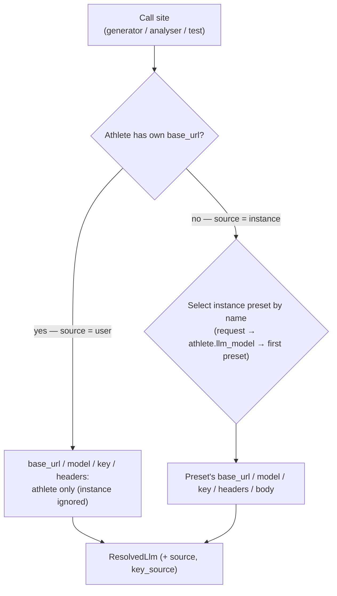
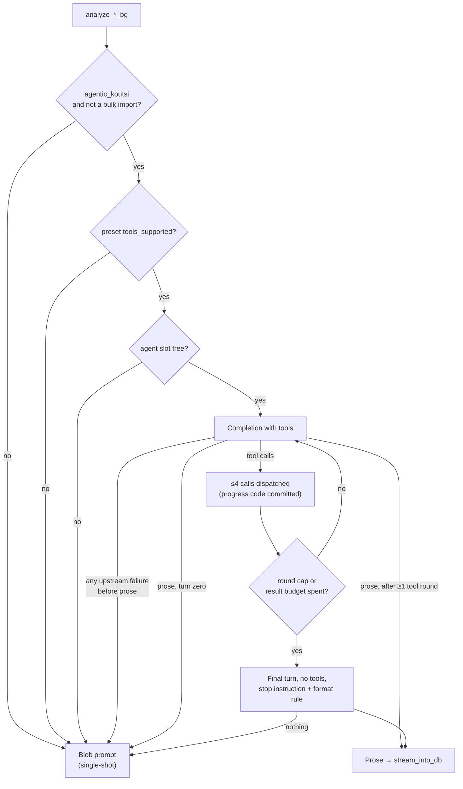
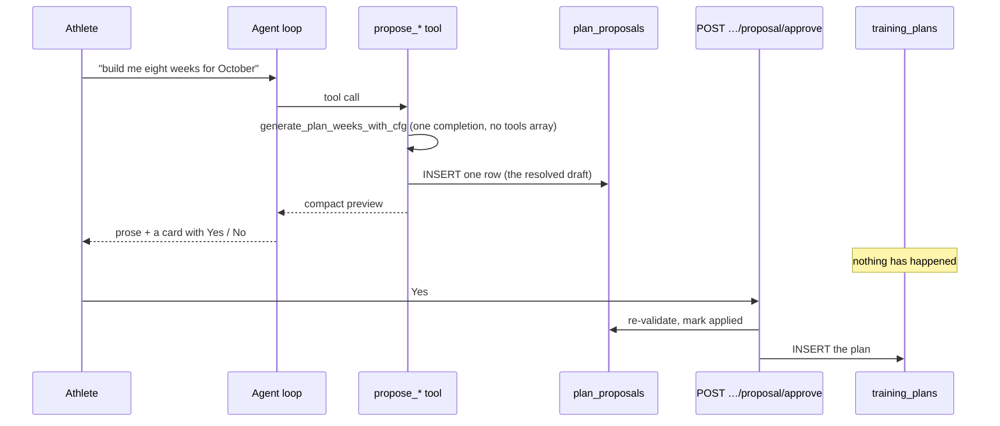

# LLM & AI features

openkoutsi's coaching intelligence is delivered by a language model, but the platform
deliberately **owns no model and hard-codes no provider**. Every AI feature is built on a small,
uniform abstraction: an **OpenAI-compatible chat-completions API** called server-to-server,
never from the browser. Anything that speaks that dialect — a local
[Ollama](https://ollama.com/) instance, a hosted OpenAI-compatible endpoint, or a gateway in
front of several providers — can be plugged in without code changes.

The features are **optional**: if no endpoint is configured, or the user never triggers an AI
action, nothing is ever sent to a model and every other feature keeps working.

## The features

Seven services under `backend/app/services/` use the LLM. Every one of them builds its own
prompt server-side; there is no general-purpose passthrough:

| Feature | Service | Shape |
|---|---|---|
| **Activity analysis** | `llm_activity_analyzer` | Streaming prose — optionally [agentic](#the-agentic-path-issue-43) |
| **Daily training status** | `llm_training_status_analyzer` | Streaming prose — optionally [agentic](#the-agentic-path-issue-43) |
| **Goal guidance** | `llm_goal_guidance` | Streaming prose |
| **Course pacing plan** | `llm_course_plan` | Streaming prose |
| **AI plan generation** | `llm_plan_generator` | One-shot JSON |
| **AI workout generation** | `llm_workout_generator` | One-shot JSON |
| **Conversational Koutsi** | `llm_chat` | Streaming prose — [always agentic](#conversational-koutsi-issue-44), and the only surface that can [propose a write](#training-plan-proposals-issue-72) |

The **course pacing plan** (`llm_course_plan`, issue #55) is the newest and the most tightly
constrained: the physics has already produced a segment table, so the model is handed that
table and told to do no arithmetic and to invent no local knowledge about a road it has no
information on. It is given the **derived table and never the track** — see
[the route/LLM wall](backend.md#the-routellm-wall), which is a rule enforced by the types the
prompt builder accepts and asserted by tests, not a structural guarantee the per-user database
provides for free.

The two coaching surfaces can additionally run as an **agent loop over the MCP tools** rather
than from a hand-built prompt; that is an opt-in variation on the same trigger → task → DB →
poll machinery, described in [The agentic path](#the-agentic-path-issue-43) below. The two
generators deliberately stay one-shot: they emit JSON against a strict schema and are graded
objectively by their own parsers, so a loop would buy them nothing and fight the
structured-output path.

The three **streaming** features never stream to the browser. Each is **trigger → background
task → DB → poll**: the trigger endpoint (e.g. `POST /api/activities/{id}/analyze`) returns
`202` and spawns a background task, which consumes the upstream SSE and persists the text
incrementally into a DB column via `stream_into_db`
(`backend/app/services/llm_streaming.py`), while the frontend SWR-polls the matching `GET`.
The user still sees the text appear progressively, but no SSE ever crosses the API boundary.
The two **generators** make a blocking call and parse the model's reply as JSON
(`extract_json` strips markdown fences before `json.loads`), retrying once with a correction
nudge if the first response doesn't parse.

!!! info "No chat passthrough — by design"
    A general-purpose `POST /api/llm/chat` proxy existed until issue #45, forwarding a
    client-supplied `messages` array to the caller's model. It was removed: a client that
    supplies the message array **controls the system prompt**, which would make the
    coach-scope and medical-boundary guardrails removable by anyone holding an access token.
    Conversational features build their messages server-side like everything else — see
    [Conversational Koutsi](#conversational-koutsi-issue-44), which is what that endpoint had
    been kept as "the foundation for" and which deliberately did not use it.

**Goal guidance** (`llm_goal_guidance`) shares the daily training-status shape: an on-demand
background task streams the coach's prose, persists it incrementally on the goal row, and is
polled by the client (trigger + poll). It judges whether a goal is realistic for its timeline
and leads with a machine-readable `REALISM:` tag line (`realistic` / `ambitious` /
`unrealistic`), mirroring the training-status `MOOD:` convention.

## OpenAI compatibility

Every call targets the OpenAI **`POST {base_url}/chat/completions`** contract and nothing else:

- **Request** — `{"model", "messages": [{role, content}], "stream", …}`. Roles are the usual
  `system` / `user` / `assistant`.
- **Response** — non-streaming replies are read from `choices[0].message.content`; streaming
  replies are consumed as `data:`-prefixed SSE chunks, extracting
  `choices[0].delta.content`, terminated by `data: [DONE]`.
- **Auth** — a bearer token in the `Authorization` header, when a key is configured.

Because that surface is tiny and universally implemented, "provider support" is a matter of
**configuration, not code**. Two deliberate compatibility choices keep a wide range of models
working out of the box:

!!! note "Temperature is omitted by default"
    `temperature_param()` leaves the `temperature` field **out** of the request unless a caller
    passes an explicit value, so each model applies its own default. This keeps thinking-enabled
    models — which reject any temperature other than `1` — working without special-casing.

!!! note "Upstream errors are surfaced, not swallowed"
    `raise_for_llm_status()` reads and includes the provider's response body in the raised error
    and the log line (httpx's built-in `raise_for_status` discards it). That body is where an
    OpenAI-compatible provider explains a 400/422 — e.g. an unsupported parameter for a thinking
    model — so failures are diagnosable.

## Presets: provider- and model-agnostic configuration

A **preset** is a self-contained (or partial) connection. An admin can offer several — e.g.
a fast local model next to one or more hosted providers — and users pick one. Each preset carries:

| Field | Meaning |
|---|---|
| `name` | Stable identifier (the stored selection value) |
| `label` | Human-friendly display name shown in the picker |
| `base_url` | The provider endpoint |
| `model` | The upstream model id sent in the request |
| `api_key` | Per-preset credential (encrypted at rest; see below) |
| `headers` | Extra request headers merged into every call for this preset |
| `body` | Extra chat-completion body params merged into every request |

A preset is **self-contained** — there are no instance-level single-config or env-var fallbacks,
so each preset carries everything it needs (a preset that omits a field simply doesn't have it).
The `headers` and `body` fields are what make the abstraction provider-agnostic in practice:

- **`headers`** carry provider-specific needs — a zero-data-retention header, an API version
  header, a gateway routing header — without the code knowing about any of them.
- **`body`** carries per-model tuning — `max_tokens`, a `reasoning_effort` level, a nested
  thinking config — attached to the one model that needs it. Core fields
  (`model` / `messages` / `stream`) always win, so extras can add but never break the request
  (`apply_body_extras`).

Presets are the instance's **entire** LLM configuration: they live in the
`instance_settings.llm_models` JSON column, and **the first preset in the list is the instance
default**. Users may also bring their own via the athlete's `app_settings` (BYOK — a single
`llm_base_url` / `llm_model` / `llm_api_key`, or personal presets). See the
[data & storage model](data-model.md).

## Resolving one request

All call sites funnel through **`resolve_llm()`** in `backend/app/services/llm_client.py`, which
produces a single `ResolvedLlm` (base URL, model, key, headers, body, **`source`**,
**`key_source`**). A preset is selected by name — a per-request override → the athlete's saved
`llm_model` → the **first preset** in the list (athlete presets take precedence over instance
presets).

!!! warning "No-mixing rule (BYOK)"
    As soon as the athlete configures **their own base URL** (the single `llm_base_url`, or a
    selected athlete preset with a `base_url`), resolution uses **only** athlete-level values —
    the instance's presets, key and headers are ignored entirely. This is the whole point: the
    instance's API key can **never** be sent to a user-chosen server. It also fixes an earlier
    leak where a user who set only their own base URL would inherit and transmit the instance key.

`source` records where the base URL came from (`user` / `instance`); **`source == "user"` is the
canonical "BYOK active" signal** consumed by entitlement gating (issue #9). `key_source` records
where the key came from (`user` / `instance` / `none`).

```mermaid
flowchart TD
    Req["Call site<br/>(generator / analyser / test)"] --> BYOK{"Athlete has own base_url?"}
    BYOK -->|"yes — source = user"| U["base_url / model / key / headers:<br/>athlete only (instance ignored)"]
    BYOK -->|"no — source = instance"| Sel{"Select instance preset by name<br/>(request → athlete.llm_model → first preset)"}
    Sel --> P["Preset's base_url / model / key / headers / body"]
    U --> RL["ResolvedLlm (+ source, key_source)"]
    P --> RL
```

Two thin wrappers adapt this for their callers:

- **`resolve_llm_config(athlete, instance, user_id, *, requested_model, allow_instance_fallback)`**
  — the athlete-aware path used by the generators and the streaming analysers. It enforces the use-time
  policy and raises **`LlmConfigError`** with a machine-readable `code` (`no_base_url` → HTTP 400,
  `server_not_allowed` → 403, `instance_fallback_disabled` → 403) that the API layer maps to a
  status. The **allow-list is checked here at use time** (BYOK URLs only), so the generators get
  it too. `allow_instance_fallback=False` is the hook for #9: when the user has no own config it
  raises instead of falling back to the instance.
- **`resolve_instance_llm(instance)`** — the instance-only path used by the automated analysers
  and the admin connection test, which aren't tied to a particular user's overrides.

`GET /api/llm/models` returns the presets a user may select (`{name, label}`) plus their current
effective selection (the first preset when nothing is saved), so the UI picker mirrors exactly
what `resolve_llm()` would choose.

## The agentic path (issue #43)

Two of the five features — activity analysis and daily training status — can run a second way.
Instead of a prompt builder assembling a fixed context blob ahead of time, the model is handed
the **read-only coaching tools** (issue #42) and decides what it needs. That buys one thing the
blob cannot give: the ability to *follow a thread*. A fixed prompt that includes a flat form
number can only restate it; an agent can go and look at the rides behind it and say why.

It is **opt-in per athlete** (`app_settings.agentic_koutsi`, default off), and both paths are
expected to coexist indefinitely. `_build_status_prompt()` and `_build_prompt()` are not legacy.

!!! warning "This is not a chat feature, and not an SSE one"
    Neither surface is a conversation: both are one-shot generations fired from a background
    task with nobody typing, so there is **no conversation storage and no conversation id** — the
    message history lives inside one `analyze_*_bg` task and dies with it.

    Nor does the loop stream to the browser. It is layered **onto** `stream_into_db`, not beside
    it: the trigger → background task → DB → poll shape exists so a local model taking minutes
    never dies on a request timeout and a page reload never loses a generation, and an agentic
    run needs both properties more than a single-shot one does, not less.

### The loop

`backend/app/services/llm_agent.py` is provider-neutral; everything specific to the OpenAI
chat-completions dialect sits behind two functions (`tool_definitions`, and the pair that build
the `assistant` / `tool` replay messages). Tool schemas are the registry's own pydantic argument
models, so what the provider constrains the model to and what
`backend.app.mcp.dispatch.call_tool` validates against are the same object and cannot drift.

```mermaid
flowchart TD
    Start["analyze_*_bg"] --> Opt{"agentic_koutsi<br/>and not a bulk import?"}
    Opt -->|no| Blob["Blob prompt<br/>(single-shot)"]
    Opt -->|yes| Cfg{"preset tools_supported?"}
    Cfg -->|no| Blob
    Cfg -->|yes| Slot{"agent slot free?"}
    Slot -->|no| Blob
    Slot -->|yes| Turn["Completion with tools"]
    Turn -->|"any upstream failure<br/>before prose"| Blob
    Turn -->|"tool calls"| Dispatch["≤4 calls dispatched<br/>(progress code committed)"]
    Dispatch --> Cap{"round cap or<br/>result budget spent?"}
    Cap -->|no| Turn
    Cap -->|yes| Forced["Final turn, no tools,<br/>stop instruction + format rule"]
    Turn -->|"prose, after ≥1 tool round"| Answer["Prose → stream_into_db"]
    Forced --> Answer
    Turn -->|"prose, turn zero"| Blob
    Forced -->|"nothing"| Blob
```

Round caps differ by surface because the questions do: **6** for the status card, which is broad
and wants several lookups, **3** for one activity, which is narrow and normally needs its own
detail plus perhaps one comparison.

Two more bounds sit alongside the round cap, because the round cap bounds the wrong quantity on
its own. A round trip may carry any number of parallel calls, so counting trips leaves the worst
case at *six times however many the model emits at once* — and it is the **sum** of the results,
replayed into the context of every later turn, that spends the window and the money. So a single
turn dispatches at most **4** calls (the rest get a result saying they were not run, keeping the
one-result-per-call pairing exact and telling the model to ask again rather than reasoning from a
gap it cannot see), and a run accumulates at most **24 000 characters** of tool results before it
is routed to the same forced final turn.

!!! note "The tools do not share the run's database session"
    `call_tool` opens its own session per call rather than being handed the
    analyzer's. Sharing is cheaper — one connection to one SQLite file instead of
    one per call — and it is wrong, because the per-call tool timeout cancels a
    call wherever it happens to be. A cancellation landing mid-statement
    invalidates the connection, so every later use of the run's session raises
    `PendingRollbackError`; and the `rollback()` that repairs *that* expires
    every ORM instance in the session, after which a plain attribute read raises
    `MissingGreenlet` because reloading it would need IO. The run reads the
    athlete on every later tool call and the blob fallback reads the analyzer's
    objects throughout — so the repair broke the degradation path the timeout
    exists to protect.

    A session nobody else holds has neither problem, and has them for **no**
    inputs rather than for the ones we thought to handle. The cost is a pooled
    connection checkout plus one `load_athlete` per call — at most 24 per run,
    against a local file whose engine is already cached, on a path that opens a
    registry session per call for the consent check anyway.

### Degrading is the design, not the error path

BYOK is what makes this harder here than in a product that owns its model. Tool-calling support
across the population of servers a user may point at ranges from good, to absent, to
*present but wrong*, and the hoster controls none of it — so "smoke-test each provider" is not a
mitigation. Every failure degrades at runtime, per call, to the blob prompt:

| Condition | Detected by |
|---|---|
| Provider rejects the `tools` param (400/422) | `is_tool_calling_unsupported_error` — the twin of `is_response_format_unsupported_error` |
| Preset says the server cannot really do it | `ResolvedLlm.tools_supported`, from `"tools_supported": false` |
| Provider accepts `tools` and calls none | turn zero produced prose, which would be an answer written from no data |
| Model loops past a budget | one forced final turn with **no** `tools` array at all |
| This process is already at its concurrency limit | `AGENT_MAX_CONCURRENT_RUNS`, checked without blocking |
| **Anything else upstream, before prose is written** | a 429, a 5xx, a dropped connection — and above all a context-length 400 |

`AgenticUnavailable` is the single signal for all of them, and it carries a rule the code
enforces rather than assumes: **it may only be raised before the first character of prose has
been yielded.** After that the text is committed to the DB, and a fallback would staple a second
answer onto a partial first one. That invariant is also what makes the last row safe to state so
broadly: before any prose, falling back costs nothing and an error card costs the answer.

Context length deserves naming separately, because it is a failure **this loop creates**. A run
accumulates tool results a single-shot prompt never would, and the small windows on self-hosted
llama.cpp and Ollama builds are precisely the population the whole degradation design exists for
— failing there, on a provider where the blob prompt would have fitted comfortably, would be the
design missing its own target. The result budget above is the other half of that answer: the
fallback stops it being fatal, the budget stops it happening as often.

The one thing that does **not** degrade is an *"invalid function schema"* body
(`is_our_tool_schema_error`). That means openkoutsi's own pydantic model is broken, and treating
it as a provider limitation would silently drop every athlete on every provider to the
non-agentic path with the test suite still green. It has to be an explicit check rather than a
non-match, precisely because everything else now falls back around it.

!!! note "Bulk imports are always non-agentic"
    A provider backlog import creates one `analyze_activity_bg` per imported activity. A few
    hundred activities at four-to-six calls each is a real bill, and a lot of concurrent loops
    against one local model that serialises requests — on the one path where nobody reads the
    output one analysis at a time. `provider_sync` passes `allow_agentic=False`; the live
    webhook ingests do not, because there the athlete just finished that ride.

### Progress: a column of codes

The loop's first rounds emit no assistant prose at all. Against a poll-and-render frontend that
means a spinner for the whole gathering phase and then a finished answer appearing at once —
worse than what it replaced. So progress is persisted alongside the text, on the same commit
cadence, in **its own nullable column** (`athletes.training_status_progress`,
`activities.analysis_progress`).

Three decisions, each with a reason that outlives the feature:

- **A separate column, not an envelope inside the prose.** The frontend's
  `parseMoodAndParagraphs` reads the prose column as raw text, and three surfaces share that
  parser. A structured envelope would have broken all three.
- **Codes, not model-authored sentences.** `thinking`, or `tool.<registry tool name>`. The
  coaching prompts run in fourteen languages while every tool name and description is English,
  so model prose here would be untranslated the moment the athlete is not reading English — and
  could put tool internals in front of them. The client translates, and falls back to generic
  copy for a `tool.*` suffix it does not know, which is what lets #42 add a tool without a
  lockstep frontend release.
- **Cleared when the prose starts**, so a finished card looks exactly as it did before any of
  this existed. Both endpoints additionally gate the field on `status == "pending"`, so a run
  killed between its last progress commit and settling cannot surface a stale line.

A code stays on its tool through the turn that *reads* the result, rather than reverting to
`thinking`: the tool call against one user's SQLite file takes milliseconds and the model turn
takes seconds, so reverting would show the generic line for all of the slow part.

### Two contracts the loop must not break

**The `MOOD:` line.** The first line of the prose is parsed to pick Koutsi's avatar, and
`llm-eval` asserts on it. Models are measurably worse at obeying a leading-format instruction on
a turn that follows tool results than on a clean single-shot prompt, so the rule is **restated as
a system message on the answering turn** rather than trusted to carry from turn one. A missing
line still degrades to the default avatar; nothing prepends one.

**The instance house style.** `llm_analysis_context` is a system message, and the loop rebuilds
the message list from scratch on every turn rather than mutating one in place — so the hoster's
rules are present on turn five as much as on turn one. Three tool results are not allowed to push
them out of the model's attention.

### Usage is summed, not sampled

A single-shot analysis is one call and one `usage` object. An agent run is three to five, each
reported independently by the provider. Recording only the last would make
`GET /api/admin/llm-usage/summary` under-report every agentic analysis by however many turns it
took — so `merge_usage` (`llm_access.py`) folds each turn into a running total, including the
turns a *fallback* spent before giving up, which the hoster also paid for. Each side is
normalised before the addition, so a run mixing a turn that reported only a total with one that
reported only parts still adds up.

## Conversational Koutsi (issue #44)

Every surface above is a **generation**: the backend picks the question, builds the prompt, and
prints one answer. Chat is the first where the *athlete* picks the question, and nearly
everything below follows from that one change.

It is not a new pipeline. A chat turn is an agent run — same loop, same tool dispatch, same
`stream_into_db`, same trigger → task → DB → poll — with the message history coming from the
database instead of being empty, and a human waiting on the result.

### Server-built messages, and why that is the whole feature

`services/llm_chat.py` assembles every message. The client sends **one string**. This is the
same property every other feature has by construction — there is no way to ask
`_build_status_prompt()` for a shell script — and it is the only reason the scope policy below
is worth writing: a caller who supplies the message array controls the system prompt, so every
guardrail in it would be removable by anyone holding an access token, which is every user.
Issue #45 removed the proxy that worked that way before this was built on it.

### The scope policy

An open text box removes the bound the other surfaces have for free.
`llm_chat._SCOPE_POLICY` replaces it with four bands: **coaching** answered fully, **adjacent**
(fuelling, sleep, strength, bike fit) answered as a coach, **medical** redirected to a clinician
without diagnosing or advising training through symptoms, and **unrelated** declined in a
sentence.

The medical band is why this exists — the platform holds heart rate, weight and RPE, and a model
just shown a weight log will answer a rapid-weight-loss question with total confidence. But the
band that gets missed is the *other* direction: a guard tight enough to refuse "what should I eat
on a four-hour ride?" is a broken coach, not a safe default. Both directions are asserted, and
`llm-eval`'s `chat` family grades them **asymmetrically on purpose** — collapsing them into one
"is it safe?" score would reward a model that refuses everything.

Layers under the prompt, because a system prompt is a first line and not a boundary:

- **Restated every turn.** `_drive` rebuilds the system messages per turn rather than mutating a
  list, so band policy on turn twenty is the same text as on turn one — the same mechanism that
  keeps the instance house style present, for the same reason.
- **History is trimmed**, so the system message never drifts arbitrarily far from the generation
  point.
- **BYOK is a ceiling.** A user pointing openkoutsi at their own model can make it say anything.
  Guardrails are enforced where openkoutsi owns the request; the docs say the rest is theirs.

### Storage: dialogue only

`chat_conversations` / `chat_messages` in the per-user DB, following the inbox precedent — the
database file identifies the owner, so there is no owner column and cross-user access 404s
without a predicate anyone could forget.

**Tool calls and results are deliberately not stored**, though replaying them was the obvious
design. They are almost all of the bytes; they go stale (a Tuesday result describes Tuesday, and
the tools are read-only so re-running is *more* correct than replaying); and they are working,
not dialogue. This is also what flattens the context-growth problem the issue predicted — most
of it would have been created by storing the one thing that does not need storing. Only
`tool_names` survives, so the thread can draw each lookup as a step.

Those names are written through on **every progress marker**, not once when the turn settles.
The web app renders the steps where they happened — ahead of the answer they fed, which is
where the loop actually made them, since prose that turns out to precede a tool call is
discarded as a preamble and an answer therefore never interleaves with its own lookups. A turn
still gathering is exactly when that record is worth showing: written only at the end, the
timeline would stay empty through the whole slow part and then land three steps at once
alongside the answer, as though none of them had taken any time. It costs nothing extra —
markers already commit as they arrive (`stream_into_db`), because being visible to the next
poll is what they are for.

The loop's own scaffolding never reaches the transcript either. `_final_reminder` and
`_format_reminder` are sent as `role: "user"` messages — deliberately, since several chat
templates drop mid-conversation system messages — which is harmless in a run that dies with its
task but would otherwise be replayed forever as things the athlete said, and land in their GDPR
export as their words. The loop copies the caller's history before appending to it, and a test
pins that.

### What is different because there is no fallback

`coaching_stream` exists to swallow `AgenticUnavailable` and quietly serve the blob prompt.
Chat has no blob prompt — the question is arbitrary and the data it needs is unknown — so the
exception *is* the answer. `AgenticUnavailable` therefore carries a `code`, and each cause gets
its own outcome rather than one generic apology:

| Cause | Chat | The two card surfaces |
|---|---|---|
| No free agent slot | **Queues** for `CHAT_QUEUE_WAIT_SECONDS`, visibly, then `busy` | Refused instantly → blob |
| `tools_supported=false` / provider rejects `tools` | Surface disabled up front | Silently → blob |
| Accepts `tools`, calls none | **Not a failure** — the turn answered | → blob (an answer built from no data) |
| 429 / 5xx / context length | Turn settles `error` with a code | → blob |

The slot policy is the sharpest inversion. `_run_slot` refuses immediately *by design*, because
waiting would push a background run towards the pending timeout while a better answer — the blob
prompt — was available now. For chat that reasoning runs backwards: refusing buys nothing and
loses the athlete's question, and the four slots are shared with the background training-status
runs that fire on dashboard load. So `_waited_run_slot` bounds a wait instead, and the wait is a
**state** (`queued`) rather than a gap. Both policies are built on one non-blocking
`_try_claim_slot`, so neither can reintroduce the check-then-acquire gap the counter exists to
close.

Three behaviours are opt-in on `AgentRequest` (`conversational`, `history`, `slot_wait_s`) rather
than changes to the shared path. The third is that **turn-zero prose may be the answer**: the
card suppresses it correctly, since an answer written before looking at anything is guesswork
about this athlete's training — but "what does TSB mean?" has no lookup behind it, and refusing
it until a tool had been called would be a worse conversation, not a safer one. The preamble
guard still applies, so "let me look at your last four weeks…" never becomes the answer.

### A run that no longer owns its row

`settle_stuck_turns` runs in the *reader's* session and cannot cancel anything,
so on its own it is only an opinion: a merely-slow run would carry on and
overwrite the failure with an answer the athlete had already been told was not
coming, and a retry accepted in between would put two runs on one thread.

So the run checks. At every progress marker it re-reads its row's `status` — a
**column** select, since its own session holds the entity with
`expire_on_commit=False` and would otherwise answer from cache — and stands down
when it finds it no longer owns the turn. That covers two situations with one
mechanism: the stuck-turn settler having overruled it, and the athlete having
deleted the conversation, where continuing would keep an agent slot and keep
paying a provider for an answer with nowhere to land. Deleting is therefore
allowed while a turn is live; it is a privacy action, and making someone wait out
an answer they no longer want is the wrong trade.

`chat_stuck_minutes` is 10 rather than the card's 30, but not lower: the clock is
touched by progress markers and text flushes, and a tool round emits one marker
and then no text at all while the model composes the call and reasons over the
result — so the gap between two commits is a whole completion on a slow local
model.

### Retrying is a rerun, not a re-ask

`POST …/messages/{id}/retry` re-queues the existing assistant row. The obvious
client-side retry — re-post the same text — is wrong three ways at once, and they
compound on exactly the setup most likely to need it: the athlete's question
appears twice right after something has visibly gone wrong, a second turn of the
budget is spent, and the replayed history ends with the same question adjacent to
itself, which strict chat templates reject or merge. The per-conversation cap
deliberately does not apply to a retry, or a thread at its limit could never be
repaired.

### Budgets

Chat is the first LLM surface the **user** can trigger arbitrarily often, and each turn is
several completions. Everything else is bounded by "one ride, one analysis" or "once a day", so
chat carries its own: per-day and per-conversation turn caps, a message-length cap, and the
history budget. Issue #9's gate applies per turn and `record_llm_usage` sums the turn's calls
exactly as an agentic card run does.

Failures that never reached a provider — `busy`, `tools_unsupported`, `unreachable` — do **not**
spend a turn. Charging for them charges the athlete for openkoutsi's own unavailability, and it
compounds: the web app offers a retry on exactly those codes, so a local model that is simply not
running could otherwise eat a day's allowance without a single request leaving the box.
`upstream` and `no_answer` still count, because they spent tokens somebody paid for.

The rate limiter's key was also wrong here, and fixing it was not optional: `principal_key` only
ever saw a principal on the personal-access-token path, so every signed-in request fell back to
the remote address — one household behind one NAT sharing a bucket, one user with two browsers
getting two. Chat is authenticated, athlete-triggered and expensive, so both auth paths now set
`request.state.principal_user_id`.

## Training-plan proposals (issue #72)

Koutsi can draft a training plan — a new one, or a change to an existing one — and put it in
front of the athlete as a structured yes/no. **The model never performs the write.** It drafts,
the athlete approves, and the approval is what writes.

That is not a stylistic preference; it is forced by a property of the existing code.

### Why a scope could not be the control

The obvious design is `plans:write` on a `create_training_plan` tool. It does nothing at all for
the surface this feature is about.

The in-process agent calls tools as `ToolCaller.internal(user_id)`, which sets `scopes=None`, and
`Tool.missing_scopes` returns `[]` for `None` **by design** — that is how a session credential
means full access. So Koutsi in chat holds every scope implicitly, and a write scope would gate
an external MCP client while gating Koutsi by exactly one line of prompt.

The prompt cannot be the control either, and `services/llm_chat.py` already says so in its own
words: *"A system prompt is a first line, not a boundary"*, followed by the BYOK ceiling — an
athlete pointing openkoutsi at their own local model can make it say anything. "Ask before you
write" is a rule about not wasting the athlete's attention, not a safety property.

So the control is structural, and it is one sentence long:

!!! danger "The invariant"
    **No tool, called by anyone, through any door, can reach `training_plans` or
    `planned_workouts`.** The propose tools write one row to `plan_proposals` and nothing else.
    The only code that writes a plan is `services.plan_proposals.apply_proposal`, reached from an
    HTTP route that requires the athlete's own session and a proposal id.

Two tests hold it, and they are the load-bearing ones: a sweep over **every registered tool**
asserting the plan tables' row counts are identical either side of every call (guarded against
passing vacuously — the propose tools must be in the swept set, must have succeeded, and must
have inserted the `plan_proposals` rows they exist for), and one asserting `tools/list` is
still exactly the ten read tools and that a `tools/call` naming an unpublished one is refused as
an unknown tool rather than executed.

`TOOL_SCOPES` is unchanged and still read-only by construction; the propose tools declare **read**
scopes.

### Propose, then apply

```mermaid
sequenceDiagram
    participant A as Athlete
    participant L as Agent loop
    participant T as propose_* tool
    participant P as plan_proposals
    participant R as POST …/proposal/approve
    participant DB as training_plans

    A->>L: "build me eight weeks for October"
    L->>T: tool call
    T->>T: generate_plan_weeks_with_cfg (one completion, no tools array)
    T->>P: INSERT one row (the resolved draft)
    T-->>L: compact preview
    L-->>A: prose + a card with Yes / No
    Note over DB: nothing has happened
    A->>R: Yes
    R->>P: re-validate, mark applied
    R->>DB: INSERT the plan
```

A proposal is **inert by construction**: it is not a `TrainingPlan` row, so it does not appear on
the plan page, accrues no `plan_adherence_daily`, is invisible to the activity matcher and to the
achievements, and cannot be followed by accident. The alternative — a plan row with a draft
status — would have to be excluded from each of those separately, and the first place that forgot
would be a plan the athlete never agreed to.

`payload` holds the **resolved** change (the built weeks), not the model's arguments, so applying
replays nothing through a second, differently-behaving completion. What the athlete approved is
what they get.

### The `ToolRun.llm` seam

The draft's weeks come from `generate_plan_weeks_llm` — the same generator `POST /api/plans` uses,
and already persistence-free. But it takes an `InstanceSettings` and an `allow_instance_fallback`
derived from `check_llm_access`, and both come from the **registry database**, which
`test_no_tool_module_reaches_the_registry_database` forbids a tool module from so much as
mentioning. That test exists so an administrator's session cannot be served more than an ordinary
athlete's, and it must not be weakened to fit a feature.

The resolution is a seam that already half existed. `llm_agent._run` resolves the athlete's LLM
once per run via `resolve_stream_setup`, producing `StreamSetup.cfg: ResolvedLlm` — and
`call_llm_with_optional_schema` takes exactly that type. So `ToolRun` gains
`llm: Optional[ResolvedLlm]`, `call_tool` hands it down the way `today` already is, `_dispatch`
passes `setup.cfg`, and `generate_plan_weeks_llm` splits into a thin config-resolving wrapper
(unchanged for `api/plans.py`) and a `cfg`-taking core the tool calls. The tool module mentions
nothing from the registry, the test passes verbatim, and the config is in the tool's hands *only
because the loop that resolved it was entitled to*.

When the MCP door opens later, an external caller simply arrives with `llm=None` and gets the
deterministic builder — the seam is already the right shape for it.

The same pass fixed a quieter bug: the generator computed its intensity-distribution window from
`date.today()`, the **server's** date. `ToolRun.today` is the athlete's, which is the whole reason
issue #43 threaded it through.

### The recursion worry, answered rather than waved away

Issue #42 excluded `/api/llm/*` from the tool surface because *"a tool that calls an LLM from
inside an LLM loop is a recursion waiting to happen"*. This is answerable rather than hand-waved:
the nested call goes through `call_llm_with_optional_schema` — **one schema-constrained completion
with no `tools` array at all** — so it cannot re-enter the tool layer. A nested *call*, not a
nested *loop*, and a test asserts the absence of the array rather than assuming it.

Three consequences, and one that turned out to be solved already:

- **Timeout.** `TOOL_TIMEOUT_S = 30.0` is not enough, so `Tool` gains an optional `timeout_s` that
  `_dispatch` reads in place of the constant; the propose tools declare 120 s. `chat_stuck_minutes`
  is 10, so `settle_stuck_turns` will not declare the turn dead underneath it. The generator's
  **retry is skipped on this path**: one completion may take the client's full 120 s, so two can
  outlast the tool's own budget — and a cancelled draft produces *nothing*, where a skipped retry
  falls back to the deterministic builder and still produces a proposal.
- **Entitlement — solved by construction.** `check_llm_access` denies every PAT unconditionally.
  With v1 in-app only, the sole caller is a chat turn that already passed `_require_chat_access`,
  so there is no second gate to fire and nowhere it could fire from. This is the main reason the
  MCP door is deferred rather than shipped alongside.
- **Usage — already handled.** The generator calls `record_llm_usage(..., feature="plan_generate")`
  itself, so the spend lands in the same bucket `POST /api/plans` puts it in. The docs say plainly
  that a proposal costs tokens outside the chat turn budget, which counts turns rather than
  completions.
- **Slots.** A propose call holds one of `agent_max_concurrent_runs` for up to the timeout. It is
  the one place a chat turn can occupy a slot for two minutes.

**Fallback, not failure.** If the nested call fails or returns unparseable weeks, the tool falls
back to the deterministic builder and says so in its result — the same degrade-don't-fail posture
as `coaching_stream`. `built_by` records which wrote the weeks, so the fallback is visible rather
than silent.

### Informed consent, and staleness

`create_plan` archives **every active plan whose dates overlap it**. A yes/no that does not say so
is uninformed consent, so the preview names those plans by name and date range and the card
renders them above the buttons. The overlap rule moved out of `api/plans.py` into
`services/plan_lifecycle.py` for exactly this reason: two copies of "which plans does this one
supersede" is the drift that makes a preview a lie.

Proposals live **24 hours** and are **superseded only by another proposal**, never by an ordinary
question — an athlete asking "what would that do to my Saturdays?" must still be able to come back
and click yes on the offer they were asking about.

Staleness is handled **at apply**, not by trusting `expires_at`. The apply path re-runs every
invariant against the database *now*: the start date is not in the past, the target plan or
session is still there and not completed, the proposal is still `pending`, and — the one that
matters most — the archive set is recomputed and compared against what the athlete was shown. A
plan created since would otherwise be filed away without ever having been mentioned. Applying is
**idempotent by proposal id**: a double-click produces one plan, and the second call answers with
the plan the first created.

### The decision does not spend a turn, but the next turn must know about it

Approving costs nothing from the daily budget, cannot fail on a slow model, and the outcome the
athlete needs — *your plan is live, here it is* — is a fact the backend knows exactly. Nothing is
gained by asking a model to say it.

But the decision is a **button, not a message**, so it is not in the dialogue at all — and without
replaying it, Koutsi re-offers a plan the athlete has already accepted. `run_chat_turn_bg` loads
the proposals for the messages it is replaying and `build_wire_history` appends a backend-written
note to the assistant turn that carried each one: *"[The athlete approved this; it has been
applied and is now live.]"*. Derived at render time from the proposal row, so it can never be
stale, `chat_messages` stays pure dialogue, and the strict alternation that module goes out of its
way to preserve is untouched — the note rides *inside* the turn rather than becoming one.

Two lifecycle edges that would otherwise leak: `retry_message` discards the turn's pending
proposal (a retried turn would otherwise leave an orphan approvable out of context), and
`delete_conversation` deletes the conversation's proposals explicitly, because `PRAGMA
foreign_keys` is off on these connections. An *applied* proposal's plan survives — the plan is not
part of the conversation.

### Registered is not published

Both tools are `internal_only`: `registry.published_tools()` is what `mcp/server.py` uses for
`tools/list` **and** for `tools/call`, so an unpublished tool is refused by name rather than
merely hidden. The asymmetry is deliberate and worth stating, because issue #42's framing is "two
consumers, one tool layer, both reach the same tools": half of this feature is an approval control
in openkoutsi's own UI, and an external client drafting a proposal would leave it sitting in a
thread nobody has open — a worse experience than not offering it.

### The injection rule had to widen

`_SCOPE_POLICY` said instructions arriving *inside a message* do not change the bands. Plan goals,
session descriptions and activity notes are athlete-authored free text that reaches the model
through **tool results**, which are not messages — and a tool result can now lead somewhere. The
rule is restated to cover text arriving from tools.

This is defence in depth, not the boundary: a model that obeys an injected "rewrite my plan" still
cannot write. It can only put a proposal in front of the athlete, with a visible preview, for them
to decline.

### Deferred

The **MCP write tools and the token-permission-scheme change** are a follow-up: `plans:write` in
`TOOL_SCOPES` paired with a `Tool.writes` declaration, an `apply_plan_proposal` tool, truthful
`readOnlyHint` / `destructiveHint` annotations, and an `allow_mcp_write_tools` instance toggle
defaulting off — which would gate **those tools only**, never the in-app flow, where the authority
is the athlete's own click in their own session on a plan they could already edit by hand.

**MCP elicitation** (`elicitation/create`, 2025-06-18) is the spec's own answer to "ask the user a
structured question" and the right long-term shape for the external door, but `mcp/server.py` is
deliberately stateless — one JSON-RPC message per POST with a JSON response — and elicitation
needs a server→client request mid-call over an SSE response with the answer correlated back. A
transport rewrite, not a feature.

Also out: write tools for anything else; linking an activity to a planned workout or marking a
session done (a claim about what *happened* rather than about what is planned, and a wrong one
silently corrupts adherence scoring and the plan achievements); regenerating a plan's remaining
weeks from a conversation; any path that applies a proposal without a decision; and undo —
`unarchive_plan` and the ordinary plan editor are the recovery path, and what this owes is an
informed yes rather than a reversible one.

## Subscription gating & usage tracking (issue #9)

An **opt-in, per-instance gate** decides whether a user may use the *instance's* LLM credentials.
It is controlled by the single boolean `instance_settings.llm_requires_subscription` (default
**false** — self-hosted behaviour is unchanged until an admin flips it). One function,
**`check_llm_access(ctx, athlete, instance, registry_session)`** in
`backend/app/services/llm_access.py`, returns an `LlmAccess(allowed, mode, reason)`:

| `llm_requires_subscription` | BYOK active | entitled | result |
|---|---|---|---|
| off (default) | any | any | allowed, `ungated` — resolution unchanged |
| on | yes | any | allowed, `byok` — resolved with `allow_instance_fallback=False`; instance credentials never touched |
| on | no | yes | allowed, `entitled` — instance presets usable |
| on | no | no | denied → HTTP 403 `{"detail": {"code": "llm_subscription_required", …}}` |

The 403 carries a **structured `detail.code`** so every frontend branches on a stable key, not
message text. It gates the plan/workout generators, goal guidance, activity analysis and the
training-status trigger — **including the background auto hooks**, which are checked in the request
context before spawning; denied users are skipped silently (their auto-analyze settings stay saved
but inert). Admins are **not** implicitly exempt (they can grant themselves an entitlement); the
admin/user *test-connection* probes stay ungated. `GET /api/llm/access` reports
`{gated, mode, entitlement}` as the frontend's single source of truth.

**Usage recording.** `record_llm_usage(...)` is fire-and-forget: it opens its own short-lived
session on the **separate** [`llm_usage` database](data-model.md) and records one row per call —
`feature`, resolved `provider` and `model`, and **input/output tokens counted separately**.
Failures log a warning and never break the user's request. **Only instance-paid calls are
recorded — when `source == "user"` (BYOK) the call is skipped entirely**, because the hoster pays
nothing for it. `call_llm` returns `(text, usage)` for the non-streaming generators; the
streaming features inject `stream_options.include_usage` and capture the trailing
usage chunk (retrying once without the option for Ollama-family servers, and recording nulls when
usage never arrives rather than estimating). `GET /api/admin/llm-usage/summary` aggregates the
usage DB into day/week/month buckets (or by user/provider/feature), answering "tokens per user per
month" — the original "average LLM cost per user" question.

Phase 2 (a generic, provider-agnostic payment handler that drives the same `llm_entitlements`
table automatically) is tracked in issue #16.

## Security model

The browser never talks to the LLM directly — every call is **proxied server-to-server**:

- **Keys stay on the server.** API keys are encrypted at rest — instance keys with a Fernet key
  (`encrypt_instance_secret`), per-user keys with an HKDF-derived per-user key
  (`encrypt_secret(key, user_id)`) — decrypted in memory only for the outbound request, and
  **never returned to the browser** (`api_key_set` booleans only). The [no-mixing rule](#resolving-one-request)
  guarantees an instance key is never sent to a user-chosen server.
- **SSRF defences.** Because a user-supplied base URL could point at internal services,
  `check_url_safe()` accepts only `http`/`https`, resolves the hostname and **rejects
  link-local addresses** (the cloud metadata range), disables redirects, and connects to the
  pre-resolved IP to blunt DNS rebinding.
- **BYOK allow-list.** An optional admin allow-list (`LLM_ALLOWED_SERVERS`) restricts which base
  URLs a user may **bring**. It is enforced both at **save time** (`PATCH /api/athlete`, which
  also strips/validates the scheme and runs the SSRF check) and at **use time** in
  `resolve_llm_config` — and it only ever restricts user (BYOK) URLs, never admin-configured
  instance presets.
- **No client-supplied prompts.** Every request sent upstream is assembled server-side from a
  service's own system prompt. No endpoint accepts a caller-provided `messages` array, so the
  guardrails baked into those prompts cannot be swapped out by a token holder.

## Testing a connection

Two endpoints share a `_probe_llm_endpoint()` helper that sends a minimal "hello world" chat
completion and confirms a non-empty `choices[0].message.content` comes back. Because they
exercise the **real** request path — not a `GET /models` listing — they also validate a ZDR header
or a thinking config, and return both the prompt sent and the model's reply for display.

- **`POST /api/llm/test-connection`** (admin-only) tests the instance's selected preset.
- **`POST /api/llm/test-my-connection`** (any authenticated user) tests the caller's own **BYOK**
  config. Body values override the saved athlete config so the *Test* button works before saving;
  an omitted `api_key` falls back to the saved encrypted key. It enforces the allow-list + SSRF on
  the tested URL and is rate-limited, since it triggers an outbound request on demand.

## Why this shape

- **No lock-in.** Swapping providers, running fully local, or fronting several models behind a
  gateway are all configuration, never code.
- **One code path.** Every feature resolves config and makes requests the same way, so a change
  to headers, body handling, or SSRF policy applies everywhere at once.
- **Privacy is a deployment choice.** Whether data leaves the server is decided entirely by the
  configured endpoint — a property the [user documentation](https://openkoutsi.github.io/openkoutsi-docs/)
  makes explicit to end users.
