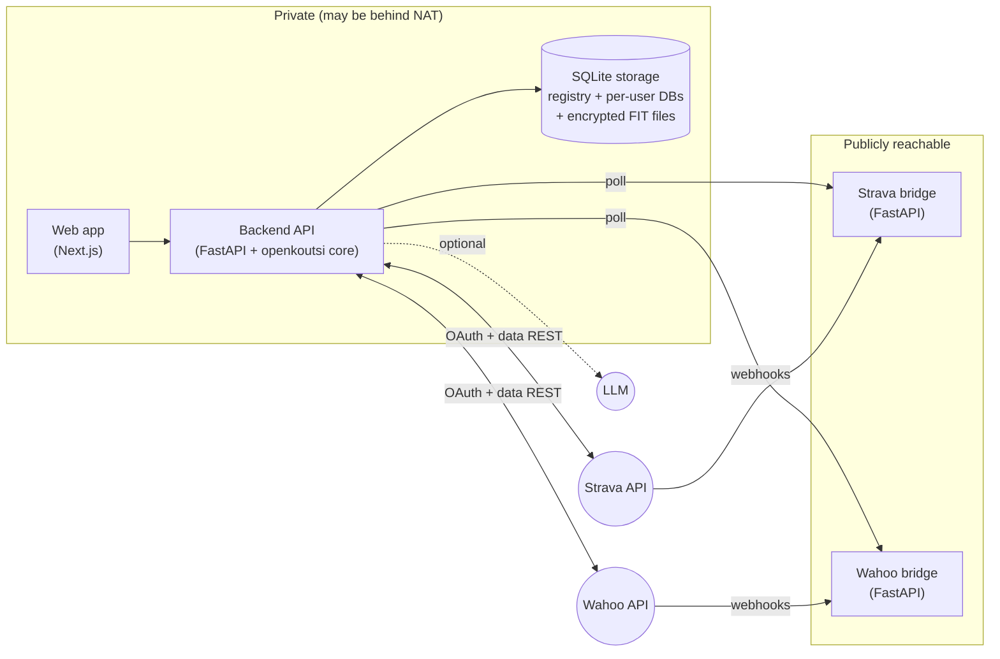

# System overview

openkoutsi is composed of a handful of cooperating services. This page introduces each
component, its responsibility, and how they are deployed.

## Components

| Component | Repository | Responsibility |
|---|---|---|
| **Web app** | [`openkoutsi-web`](https://github.com/openkoutsi/openkoutsi-web) | Next.js UI. Talks to the backend over the REST API with a JWT bearer token. |
| **Backend API** | [`openkoutsi-backend`](https://github.com/openkoutsi/openkoutsi-backend) | FastAPI application: authentication, REST endpoints, the activity-sync pipeline, metrics, and LLM features. Owns all storage. |
| **`openkoutsi` core library** | `openkoutsi-backend` (`openkoutsi/`) | Pure-Python domain logic with no web/DB dependencies: FIT parsing, training math, workout categorization, plan building, and workout export formats. |
| **Strava bridge** | `openkoutsi-backend` (`strava_bridge/`) | Standalone public webhook receiver for Strava. Queues events for the main app to poll. |
| **Wahoo bridge** | `openkoutsi-backend` (`wahoo_bridge/`) | Standalone public webhook receiver for Wahoo. Queues events for the main app to poll. |

## Deployment topology

The defining constraint is that **the main app stays private**. Strava and Wahoo both deliver
updates via webhooks, which would normally require a public inbound endpoint on the app. Instead,
each provider gets a tiny **bridge** service:

1. The bridge is the only publicly exposed piece. It receives provider webhooks and writes them
   to a local SQLite queue.
2. The main app **polls** the bridge over an authenticated outbound HTTP call, processes any new
   events, and claims them.

This lets the whole coaching app — and all athlete data — run on a home server behind NAT, with
only the (data-light) bridges on a public host. See [Integrations](../integrations/index.md) for
the full event flow.

!!! info "Single instance, per-user data"
    There are **no teams**. One deployment is a single instance that many users share; each
    user's athlete profile and training data live in their own SQLite database. See
    [Data & storage model](data-model.md).

## Observability

All services log to stdout, and the deployment captures two complementary views — both
served over HTTPS behind basic-auth on their own subdomains:

| Signal | Pipeline | Where to look |
|---|---|---|
| **HTTP traffic** | nginx access log → **GoAccess** real-time report | `stats.<domain>` |
| **Service logs** (web, backend, both bridges) | container stdout → **Vector** → per-service, daily-rotated files on a dedicated log volume; **Dozzle** live viewer | files on the data device · `logs.<domain>` |

Vector tails every container's output through the Docker API and writes it to a dedicated
`service_logs` volume on the encrypted data device, so logs survive container recreation
(every deploy recreates containers) and are pruned on a retention timer. This keeps
application logs durable without changing any service code. The collector, viewers, and
retention policy are defined in the
[`openkoutsi-ops`](https://github.com/openkoutsi/openkoutsi-ops) deployment repository.

## Technology stack

| Layer | Technology |
|---|---|
| Backend | Python 3.12 · FastAPI · SQLAlchemy 2 (async) · Alembic |
| Database | SQLite (WAL mode) — one registry DB + one DB per user |
| Auth | JWT (`python-jose` · `passlib`) |
| FIT parsing | `fitdecode` (via the `openkoutsi` core library) |
| Frontend | Next.js 15 · TypeScript · Tailwind CSS · Recharts |
| Packaging | `uv` (Python) · `npm` (web) |
| Integrations | Strava & Wahoo OAuth + webhook bridges; optional OpenAI-compatible LLM; optional transactional email (Lettermint / EuroMail, EU-based) for signup verification + password reset |
