# openkoutsi architecture

**openkoutsi** is a self-hosted cycling coaching platform. You run it on your own hardware:
upload FIT files or sync from Strava/Wahoo, track fitness metrics (CTL/ATL/TSB), build periodized
training plans, and get optional AI coaching feedback — all on a server you control.

This site documents the platform's **architecture**: how the pieces fit together, where data
lives, and how the Strava and Wahoo integrations work.

!!! info "Target (v2) architecture"
    This documentation describes the **target architecture** defined in
    [lassiheikkila/openkoutsi#122](https://github.com/LassiHeikkila/openkoutsi/issues/122).
    The two defining changes from v1 are a **simplified, token-scoped API (v2)** and the
    **removal of the multi-tenant "team" layer** in favour of a **single deployment instance
    with one SQLite database per user**. Pages flag where this differs from the older
    team-based design.

## The system at a glance

```mermaid
flowchart TD
    Browser["Browser"] -->|HTTPS| Web["Web app<br/>(Next.js · openkoutsi-web)"]
    Web -->|"REST /api/v2 (JWT)"| API["Backend API<br/>(FastAPI · openkoutsi-backend)"]
    API --> Registry[("Registry DB<br/>users · invites · connections")]
    API --> UserDB[("Per-user DBs<br/>users/&#123;id&#125;/user.db")]
    API -->|"poll events"| SB["Strava bridge"]
    API -->|"poll events"| WB["Wahoo bridge"]
    SB <-->|webhooks / OAuth| Strava(("Strava"))
    WB <-->|webhooks / OAuth| Wahoo(("Wahoo"))
    API -->|optional| LLM(("LLM<br/>OpenAI-compatible"))
```

The **main app is private**: it can sit behind NAT and never accept inbound webhooks. Instead,
small public **bridge services** receive provider webhooks into a queue, and the main app
**polls** them. Everything a single user owns — their athlete profile and all training data —
lives in **their own SQLite database**.

## How to read these docs

| If you want to understand… | Start here |
|---|---|
| The components and how they're deployed | [Architecture → Overview](architecture/overview.md) |
| How the backend is layered and processes activities | [Architecture → Backend](architecture/backend.md) |
| Where data is stored and how it's encrypted | [Architecture → Data & storage model](architecture/data-model.md) |
| The Next.js web app structure | [Architecture → Frontend](architecture/frontend.md) |
| Login, roles, and onboarding | [Architecture → Auth, roles & onboarding](architecture/auth.md) |
| The public API contract and its conventions | [API → API v2 contract](api/index.md) |
| How Strava / Wahoo connect and sync | [Integrations](integrations/index.md) |
