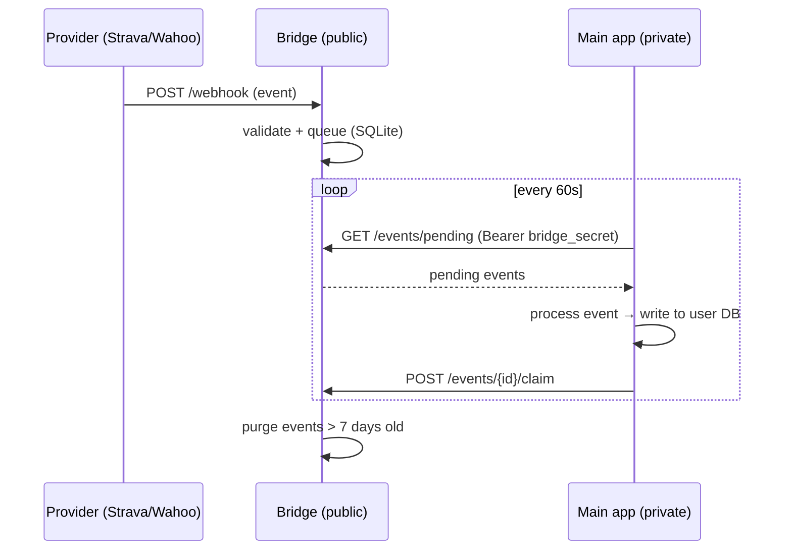

# Integrations overview

openkoutsi connects to **Strava** and **Wahoo** to import activities automatically. Both follow
the same architectural pattern, designed so the main app never needs a public inbound endpoint.

## The bridge pattern

Strava and Wahoo deliver updates via **webhooks**, which normally require a publicly reachable
endpoint. openkoutsi avoids exposing the main app by putting a tiny **bridge** service in front
of each provider:

- A **bridge** is a standalone FastAPI service — the only publicly reachable component. It
  receives provider webhooks, validates them, and writes the relevant ones to a **local SQLite
  queue**. It auto-purges events older than **7 days**.
- The **main app polls** the bridge every **60 seconds** over an authenticated outbound call,
  processes new events, and **claims** them so they aren't reprocessed.

This keeps the main app — and all athlete data — private (for example behind NAT), while only
the data-light bridges face the internet.



### Bridge endpoints

Every bridge exposes the same polling contract, authenticated with a shared `bridge_secret`
(`Authorization: Bearer <secret>`):

| Method & path | Purpose | Auth |
|---|---|---|
| `POST /webhook` | Receive a provider event | provider-specific (see below) |
| `GET /events/pending` | Return up to 100 unclaimed events, oldest first | Bearer `bridge_secret` |
| `POST /events/{id}/claim` | Mark an event claimed | Bearer `bridge_secret` |

Strava additionally needs `GET /webhook` for subscription verification (the hub challenge).

## Connections are per user

A user **connects a provider once**. The OAuth connection is stored in the registry DB's
`provider_connections` table (encrypted tokens), keyed uniquely by `(user_id, provider)`. Synced
activities are written into that user's per-user database. Tokens are refreshed transparently
before they expire.

OAuth connect, manual sync, and disconnect are handled by the generic integration routes:

```
GET    /integrations                      # available providers + connection status
GET    /integrations/{provider}/connect   # begin the OAuth flow
POST   /integrations/{provider}/sync      # trigger a manual sync
DELETE /integrations/{provider}           # disconnect
```

See the per-provider pages for the specifics:

- [Strava](strava.md) — stream-based import, HMAC-verified webhooks.
- [Wahoo](wahoo.md) — FIT-file import, token-in-payload webhooks, and pushing workouts back to
  the device.
