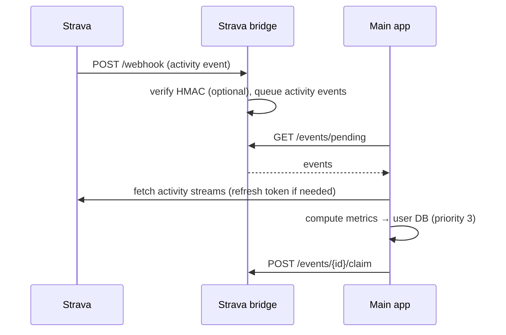

# Strava

Strava activities are imported through the **Strava bridge** and the generic provider-sync
pipeline. Strava exposes activity **streams** (not FIT files), so its data is imported via the
stream-based path.

## Connecting

A user connects Strava through the OAuth flow at `/integrations/strava/connect`. The resulting
connection (access token, refresh token, expiry, scopes) is stored encrypted in the registry
DB's `provider_connections` table.

## Webhooks → bridge

The Strava bridge (`strava_bridge/`) is a standalone public FastAPI service.

- **`GET /webhook`** — Strava subscription verification. Strava calls it with
  `hub.mode=subscribe`, `hub.verify_token`, and `hub.challenge`; the bridge echoes back
  `hub.challenge` when the verify token matches its `bridge_secret`.
- **`POST /webhook`** — receives an event. The bridge optionally validates the
  `X-Hub-Signature-256` HMAC against the configured `strava_client_secret` (accepted when the
  header is absent or the secret is unset, since Strava does not always sign). Only events with
  `object_type == "activity"` are queued; everything else is acknowledged and dropped.

Queued events record the aspect type (create/update/delete), the Strava owner id, and the raw
payload.

## Polling → import

The main app's `strava_bridge_poller` runs every 60 seconds (a no-op if `BRIDGE_URL` /
`BRIDGE_SECRET` aren't configured). It fetches pending events, hands each to
`strava_sync.process_webhook_event`, and claims it regardless of outcome (to avoid infinite retry
loops).

Import uses the **stream-based** path of the [provider sync pipeline](../architecture/backend.md):
the activity's power/HR/cadence/speed/altitude streams are fetched from the Strava API and used
to compute weighted power, training load, intensity, category, streams, and bests.

- **Source priority:** `strava` = **3** (a Wahoo FIT for the same ride, priority 2, would win
  and repopulate the activity).
- **Token refresh:** Strava tokens last ~6 hours; the pipeline refreshes when **≤30 minutes**
  remain (Strava's own recommendation).

## Configuration

| Variable | Where | Purpose |
|---|---|---|
| `STRAVA_CLIENT_ID`, `STRAVA_CLIENT_SECRET` | Main app | OAuth app credentials |
| `BRIDGE_URL` | Main app | Base URL of the deployed Strava bridge to poll |
| `BRIDGE_SECRET` | Main app **and** bridge | Shared secret for polling auth and hub verification |
| `STRAVA_CLIENT_SECRET` | Bridge | Used to validate `X-Hub-Signature-256` (optional) |

Deploy `strava_bridge/` to a public HTTPS URL and register that URL as the Strava webhook
subscription callback.
