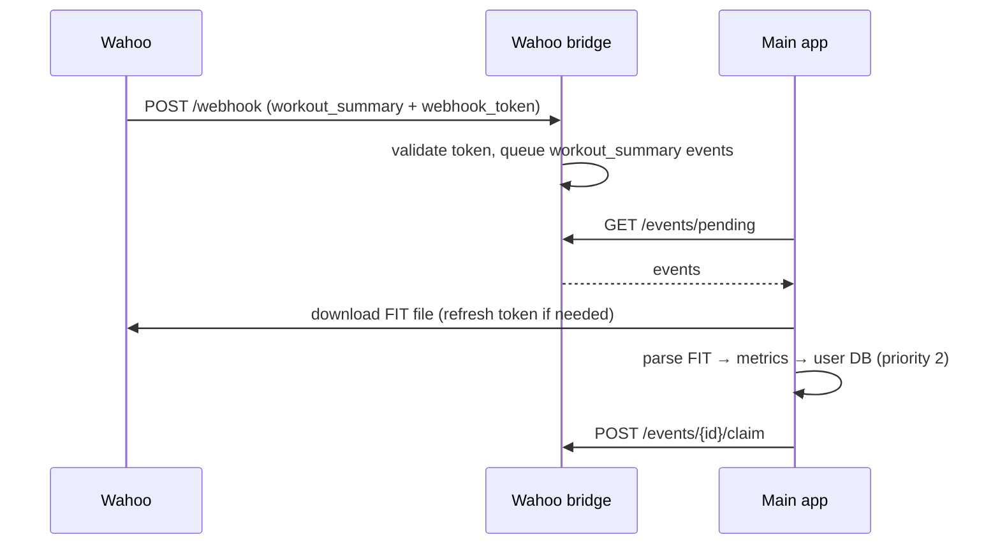

# Wahoo

Wahoo activities are imported through the **Wahoo bridge** and the generic provider-sync
pipeline. Unlike Strava, Wahoo provides downloadable **FIT files**, so its data takes the
higher-fidelity FIT-first import path. Wahoo is also the target for **pushing structured workouts
back to a head unit**.

## Connecting

A user connects Wahoo through the OAuth flow at `/integrations/wahoo/connect`. The connection is
stored encrypted in the registry DB's `provider_connections` table.

!!! note "Scopes for pushing workouts"
    Pushing workouts to Wahoo additionally requires the `plans_read`, `plans_write`, and
    `workouts_write` scopes. Users connected before this feature existed must reconnect Wahoo to
    grant them.

## Webhooks → bridge

The Wahoo bridge (`wahoo_bridge/`) is a standalone public FastAPI service. Wahoo authenticates
webhooks with a **token embedded in the JSON payload** (`webhook_token`) rather than an HMAC
header, so there is no hub-challenge endpoint.

- **`POST /webhook`** — validates the payload's `webhook_token` against the configured
  `wahoo_webhook_token` (constant-time compare). Only events with
  `event_type == "workout_summary"` are queued; others are acknowledged and dropped. The queued
  event records the event type, the Wahoo user id, and the raw payload.

## Polling → import

The main app's `wahoo_bridge_poller` runs every 60 seconds, fetches pending events, processes
them, and claims them.

Import uses the **FIT-first** path of the [provider sync pipeline](../architecture/backend.md):
the FIT file is downloaded, stored **encrypted** under the user's directory, and parsed to derive
metrics, streams, intervals, and power/distance bests. If the FIT can't be parsed, the pipeline
falls back to the summary metadata.

- **Source priority:** `wahoo` with a FIT = **2** (beats Strava's stream-based priority 3);
  `wahoo` without a FIT = **4**. The pipeline pre-fetches the FIT to determine the true priority
  before deciding whether to repopulate an existing activity.
- **Token refresh:** Wahoo tokens last ~2 hours and Wahoo **rotates the refresh token** on each
  refresh, so the pipeline refreshes as late as possible — about **1 minute** before expiry — to
  avoid unnecessary rotations.

## Pushing workouts to Wahoo

A structured workout can be sent to a connected Wahoo account as a **plan + scheduled workout**,
so it appears in *Planned Workouts* on an ELEMNT/RIVAL device. The workout is serialized with the
`wahoo_plan` export format (from the `openkoutsi` core library) and scheduled within a
**today → +6 days** window. Re-pushing the same workout **updates** the existing entry instead of
creating a duplicate.

In the v2 API this is the provider-agnostic action `POST /workouts/{workout_id}/push/{provider}`
(and `POST /plans/{plan_id}/push-upcoming/{provider}` for a plan's upcoming days) — see
[API v2 contract](../api/index.md).

## Configuration

| Variable | Where | Purpose |
|---|---|---|
| `WAHOO_CLIENT_ID`, `WAHOO_CLIENT_SECRET` | Main app | OAuth app credentials |
| `WAHOO_BRIDGE_URL` | Main app | Base URL of the deployed Wahoo bridge to poll |
| `WAHOO_BRIDGE_SECRET` | Main app **and** bridge | Shared secret for polling auth |
| `WAHOO_WEBHOOK_TOKEN` | Bridge | Token expected in the webhook payload |

Deploy `wahoo_bridge/` to a public HTTPS URL and register it as the Wahoo webhook callback.
